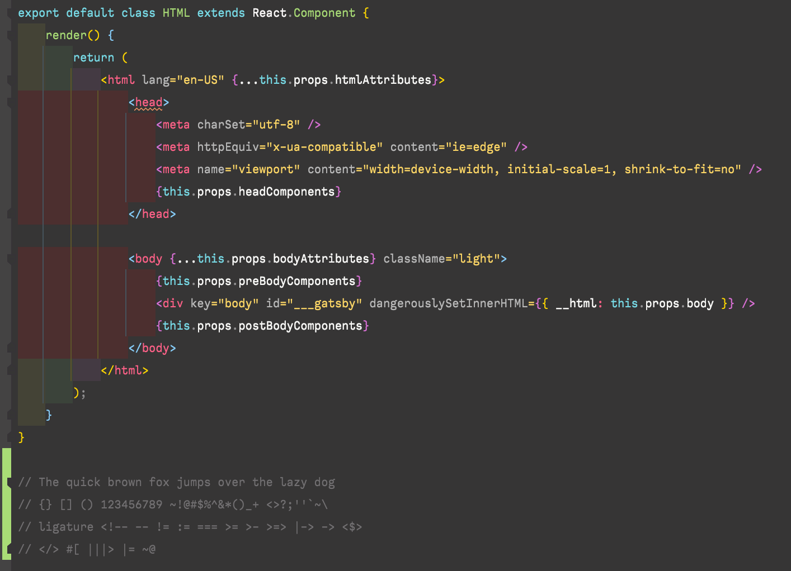
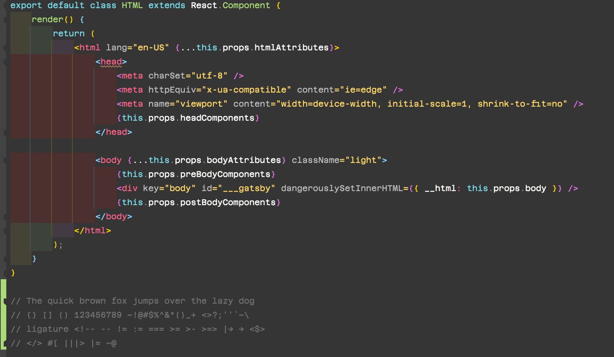

나는 한가지 이상한(?) 루틴을 가지고 있다. 매일 아침에 IDE를 켠 다음 (대부분의 경우 webstorm) 오늘 기분에 맘에드는 코딩폰트를 고른 다음에 코딩을 시작한다. 언제부턴가 버릇이 되었고, 하루도 빠짐없이 바꾸는 것은 아니지만 폰트를 바꾸는게 나에겐 기분전환 같은 느낌이 든다. 그러기 위해서는 당연히 많은 폰트를 가지고 있어야하는 것이 전제조건이겠다. 그래서 오늘은 내가 자주 사용하는 코딩폰트에 대해 글을 적어보려고 한다.  
일단 내가 코딩 폰트를 선정할때에 고려하게 되는 옵션들은 다음과 같다.
###Monospaced   
monospaced font는 한국어로는 [*고정폭 글꼴*](https://ko.wikipedia.org/wiki/%EA%B3%A0%EC%A0%95%ED%8F%AD_%EA%B8%80%EA%BC%B4) 정도로 해석될 것이다. 각 글자가 동일한 양의 폭을 차지하는 글꼴을 말한다. 특히 코딩을 하는데에 있어서 `indentation`은 `prettier`에도 옵션이 있는 것처럼 중요한 역할을 하기 때문에, 고정폭인 것을 중요하게 생각한다. 그래야 나란히 나란히 정렬된 느낌을 받을 수 있고, 코딩하는데 눈이 아프지 않기 때문이다.

###Ligature 
ligature는 여러 연산기호들을 묶어서 알아보기 쉬운 의미로 재표현 해준다. 예를 들어 `javascript`에서 *같지않음*을 표현하기위해 `!==`를 사용하게 된다. ligature font를 사용하게 되면 `!==`를 `≠` 이런 방식으로 변환해서 보여주어 좀더 general한 의미를 파악할 수 있도록 도와준다.  
ligature에 대한 부분은 지극히 개인적인 취향일 것이다. 개인적으로 나는 ligature font를 선호하지 않는데 그 이유는 첫번째로 일단 ligature를 지원하지 않는 폰트가 지원하는 폰트보다 많기 때문이고, 사실 그동안 개발자로 일해오면서 ligatured 되지 않은 문자들도 충분히 의미를 파악하기에 어렵지 않기 때문이다. 물론 깔끔해보이고, 의미론적으로 쉽게 알아보는 장점은 있겠지만 위의 두 이유로 나는 선호하지 않는편이다. (그렇다고 아예 안쓴다는 것은 또 아님!😏)

###Line height & Vertically middle
몇가지 free font를 살펴보다보면 line height가 유난히 작거나 또는 유난히 큰 경우가 있다. 이는 어느정도 IDE의 font size 조정을 통해서 커버할수 있지만 그렇지 않은 경우도 많다. 특히 free font의 특성상 이런 디테일들을 신경쓰지 않는 경우가 경험상 아주 많았다. line height와 비슷한 맥락에서 font의 위치가 그 line의 middle 위치가 아닌 위쪽, 아래쪽으로 치우친 경우도 왕왕 볼 수 있다. 이런 경우는 IDE에서 일반적으로 제공해주는 현재 선택된 line background와도 어긋날 수 있기 때문에, 코딩 시 내눈에 매우 거슬리는 요소중 하나이다.  
특히나 vertically 어긋난 경우는 IDE 설정을 통해 조정을 할 수 없는것으로 알고 있기 때문에 더욱 이런 요소는 잘 체크하는 편이다.

이 외에도 많은 부분을 고려하지만 위 세가지가 가장 신경쓰는 요소라고 할 수 있겠다.  
그럼 다음부터 내가 최근 잘 사용하고 있는 몇가지 폰트를 소개하고자 한다. 순위는 따로 없다.

---
 

- `Agave` 귀엽고 둥글둥글 하지만 잘 monospaced 되어 있다. 일반적인 폰트보다 사이즈가 작은것이 특징.

 
- `Calling Code` 폰트 중간중간 삐침이 있다. 폰트 weight는 다른 폰트보다 얇은편.

   
- `Rec Mono Casual` 필기체를 쓴것처럼 보이는 것이 특징. ligature를 지원한다.

 
- `Azeret Mono` 둥글둥글하고 정사각형 형태의 폰트. 요즘 자주 사용하는 폰트이다

   
- `Fantasque Sans Mono` Rec Mono Casual 과는 다른 스타일의 필기체형태. 이 또한 일반적인 폰트보다 사이즈가 작다.

 

요즘 사용해본 폰트 중 가독성과 스타일 면에서 맘에 들었던 폰트들이다. 혹자들은 이런것을 신경쓰지 않고 `IDE`에서 제공해주는 기본폰트를 사용만 해도 문제가 없을 것이다. 하지만 나는 `보기좋은것이 코딩하기도(?) 좋다` 주의이기 때문에 이런 부분도 바꿔가면서 기분전환을 하는 편이다.  
아직 나의 ***best coding font***는 정해지지 않았고, 항상 일주일에 한번쯤은 새로운 coding font를 찾아보곤 한다. 기회가 된다면 만들어보고 싶기도 하다! (someday..)  
다음에 또 기회가 된다면 coding font 2탄도 만들어봐야겠다.
