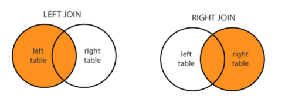

지금은 <em>**Frontend developer**</em> 라는 role을 가지고 일을 하고 있지만, 나는 전직장에서 근무할 시절 full stack 으로 개발을 했었다. `frontend`는 주로 `jquery`를 사용했던것 같고 (물론 나중에는 `react`를 사용했다), `backend`는 `java`를 이용했고 `oracle`데이터 베이스를 주로 사용했었다.  
그래도 나름 재미있고 관심있게 했던것이 `database` 였기 때문에 내가 이해하기 어려웠던 몇가지 개념과 sql 개념들을 정리해본다. (oracle 기준)

### GROUP BY와 DISTINCT
`distinct`는 주로 unique한 column이나 record를 조회하는 경우에 사용되며, `group by`는 데이터를 grouping해서 그 결과를 가져오는 경우 사용되는 쿼리 형태이다.  
사실 두개 query의 결과는 다르지 않다. 하지만 `distinct`는 정렬하지 않고 결과를 출력해, `group by`보다 성능이 빠르다. 사실 `distinct`는 내부적으로 `group by`와 동일한 코드를 사용한다. `group by`에는 기본적으로 **정렬(sort)**의 개념이 들어있어 결과에 반영되서 출력된다.
그래서 정렬이 굳이 필요하지 않은 작업이라면 `distinct`를 사용하는 것이 성능상 이득이다.

### OUTER JOIN
`outer join`은 join 조건에서 동일한 값이 없는 행도 반환을 할때에 사용한다. 즉 A, B Table을 서로 join 할때에 조건이 맞지 않는 데이터도 표시하고 싶을때 outer join을 사용한다.  
가장 기본적인 inner join은 조건이 맞는 경우만 출력하지만, outer join의 경우 조건이 맞지 않은 경우 null값으로 출력한다.  

- Left Outer Join  
`LEFT OUTER JOIN` 수행시 먼저 표기된 좌측 테이블에 해당하는 데이터를 기준으로 나열하고, 우측 테이블에서 조건에 맞는 join 대상을 읽어와서 조건이 맞는 경우 맞게 배치하며, 조건이 맞지 않는 경우는 null 값으로 채운다.  
```javascript
A LEFT OUTER JOIN B 
ON A.ID == B.ID 
// A를 기준으로 전체를 보여주고, ON 조건에 맞는경우 B를 보여준다. 조건에 맞지 않는경우에는 null.
```
- Right Outer Join  
`RIGHT OUTER JOIN` <b>LEFT OUTER JOIN</b>과 반대. 수행시 먼저 표기된 우측 테이블에 해당하는 데이터를 기준으로 나열하고, 우측 테이블에서 조건에 맞는 join 대상을 읽어와서 조건이 맞는 경우 맞게 배치하며, 조건이 맞지 않는 경우는 null 값으로 채운다.
<div style="width: 50%; margin-top: -10px">
  
</div>

### ROLLUP
```javascript
SELECT [조회하고자 하는 컬럼]
FRON [Table]
WHERE [조회하고자 하는 조건들]
GROUP BY ROLLUP (묶는 기준)
HAVING [GROUP BY 결과를 보여줄 조건]
// 사용하는 방법은 2가지 이며 동일한 결과이다.
// 방법1 : GROUP BY ROLLUP(그룹컬럼) ** 사용 
// 방법2 : GROUP BY 그룹컬럼 WITH ROLLUP
```
`ROLLUP`은 `GROUP BY`와 동일한 결과를 보여주지만, 각 group에 맞는 소계 및 합계를 추가적으로 보여준다.
ex) ROLLUP을 사용해서 직업별로 급여 합계와 총계를 구하는 예제이다.
```javascript
// SQL>> 
SELECT job, SUM(sal) 
FROM employee 
GROUP BY ROLLUP(job);

// 결과>>  
JOB         SUM(SAL) 
----------  ---------- 
AA          1000 
BB          2000 
CC          3000 
DD          5000 
EE          4000 
            15000 --> 급여 합계에 대한 총계가 추가 되었다. (GROUP BY 사용시 보여지지 않음)
```

예전에 프로젝트를 진행하면서 설계가 잘못된 DB에서 OUTER JOIN을 사용하느라 2주정도 쿼리만 짰던 기억이난다. 아직 개발 스킬이 그렇게 높지 않았던 때라 야근을 엄청하면서 일했었지만, 그때 여러가지 개념을 익히고, 그 이후로는 한층(?) 쿼리를 수월하게 짰던것 같다.  
RDB의 경우 대부분 사용했던것이 <i>oracle</i>뿐이었지만, 그래도 full stack 개발시 RDB를 그나마 재미있게 했었던 것 같다. 앞으로 언제 또 SQL을 사용해볼지 모르겠지만 <span style="font-size:12px;">(과연?)</span> 앞으로 사용할 날이 온다면 또한 재미있게 일할 수 있을 것 같다.
