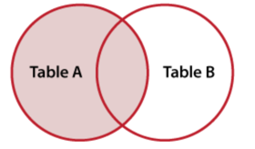

지금은 <em>**Frontend developer**</em> 라는 role을 가지고 일을 하고 있지만, 나는 전직장에서 근무할 시절 full stack 으로 개발을 했었다. `frontend`는 주로 `jquery`를 사용했던것 같고 (물론 나중에는 `react`를 사용했다), `backend`는 `java`를 이용했고 `oracle`데이터 베이스를 주로 사용했었다.  
그래도 나름 재미있고 관심있게 했던것이 `database` 였기 때문에 내가 이해하기 어려웠던 몇가지 개념과 sql 개념들을 정리해본다. (oracle 기준)

### Group by와 Distinct
`distinct`는 주로 unique한 column이나 record를 조회하는 경우에 사용되며, `group by`는 데이터를 grouping해서 그 결과를 가져오는 경우 사용되는 쿼리 형태이다.  
사실 두개 query의 결과는 다르지 않다. 하지만 `distinct`는 정렬하지 않고 결과를 출력해, `group by`보다 성능이 빠르다. 사실 `distinct`는 내부적으로 `group by`와 동일한 코드를 사용한다. `group by`에는 기본적으로 **정렬(sort)**의 개념이 들어있어 결과에 반영되서 출력된다.
그래서 정렬이 굳이 필요하지 않은 작업이라면 `distinct`를 사용하는 것이 성능상 이득이다.

### Outer join
`outer join`은 join 조건에서 동일한 값이 없는 행도 반환을 할때에 사용한다. 즉 A, B Table을 서로 join 할때에 조건이 맞지 않는 데이터도 표시하고 싶을때 outer join을 사용한다.  
가장 기본적인 inner join은 조건이 맞는 경우만 출력하지만, outer join의 경우 조건이 맞지 않은 경우 null값으로 출력한다.  

- Left Outer Join  
`LEFT OUTER JOIN` 수행시 먼저 표기된 좌측 테이블에 해당하는 데이터를 기준으로 나열하고, 우측 테이블에서 조건에 맞는 join 대상을 읽어와서 조건이 맞는 경우 맞게 배치하며, 조건이 맞지 않는 경우는 null 값으로 채운다.

  

### rollup
