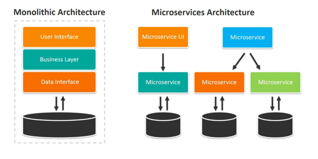
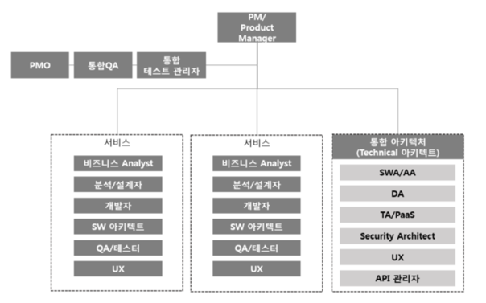
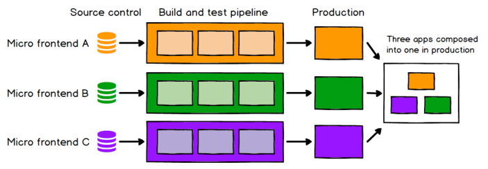

회사에서 MSA에 대해 공부하기 시작하면서 여러가지 리서치, 튜토리얼 등을 진행하는데 이곳에 조금씩 정리해보려고 한다.

## Monolithic Architecture
서비스의 모든 구성요소가 하나의 프로젝트로 통합되어 있는 형태이다. 전통적으로 개발할때 설계 해오던 방식이며, 하나의 프로젝트 안에서 모듈별로 개발을 진행하고 이 프로젝트를 한번에 통합해서 결과물을 빌드해서 서비스로 배포하는 방식을 말한다. 하지만 서비스의 규모가 점점 커지고 복잡해 질수록 Monolithic 구성은 한계를 보인다.

Monolithic application 의 단점
- 부분의 장애가 전체 서비스의 장애로 확대될 가능성이 있다.
- 한 부분의 scale out 관리가 어렵다.
- CI/CD time이 오래 걸린다.
- 하나의 개발 스펙을 사용해야하는 제한이 있다.

## MicroService Architecture
<strong>MSA(MicroService Architecture)</strong>란, 독립적으로 운영할 수 있는 각각의 기능단위의 서비스로 구성된 어플리케이션이라고 할 수 있겠다. MSA는 완전히 독립적으로 배포/운영이 가능하고, 서로 다른 기술스택을 사용해도 문제가 되지 않는다.
제대로된 MS의 경우는 하나의 기능만 수행하며 독립적으로 재사용될 수 있다.

이미지 출처: https://www.bmc.com/blogs/microservices-architecture

MSA는 일반적인 개발 아키텍쳐 라고 생각할 수 있지만 깊게 들어가게 되면 전체적인 조직의 구성이나 작업 방식과도 연결되는 부분이기 때문에, 개발적인 면만 보고 편의성만으로 전환하기엔 많은 허들이 존재할 것이고 그러한 이슈들을 해결하는데에 많은 시간과 노력이 필요할 것이다.

  
  
MSA 조직구성 (예시)

## Micro Frontend
Micro frontend는 MSA처럼 전체화면을 작동할 수 있는 단위로 나누어 개발한 후 서로 조립하는 방식이다. MSA에서 Backend 구성을 제외한 형태라고 생각하면 된다. 여기서 작동 단위에 사용된 frontend framework는 그 종류에 상관하지 않고 각각 독립적인 형태를 가진다.

  
  
Micro frontend 구성예시

Build 시점보다는 runtime에서 통합하도록 하는것이 효율적인 방법이며, 이를 구현할 수 있는 몇가지 방법이 있다
1. <i><b>iframe을 이용한 Runtime integration</b></i> 
  가장 쉬운 방식이다. iframe을 사용하면 페이지 안에 또다른 독립적인 페이지를 쉽게 구성할 수 있다. styling과 global 변수들이 독립적으로 존재하기 때문에 상당한 고립성을 가진다. 하지만 다른 옵션들보다 유연성이 떨어지는 경향이 있다. 특히 routing, history 등이 복잡해지고 responsive design 개발에도 어려움이 존재하는것이 현실이다.
    
2. <i><b>javascript를 통한 Runtime integration</b></i> 
    현실적으로 많이 사용하는 방식이다. 각 Micro app들은 `<script/>` 태그를 통해 번들이 포함되도록 설정되고, host app은 각 번들파일을 다운받고, 초기화 메소드 등을 호출한다. 각 번들파일을 독립적으로 배치가 가능하며, 다양한 방법으로 확장, 유연하게 구현할 수 있는 방법이므로 많이 채택된다.
      
3. <i><b>javascript를 통한 Build-time integration</b></i> 
Micro frontend를 패키지로 배포하고, host app이 그것을 라이브러리 dependency로 사용한다. `package.json`에 추가하는 방식. 단일 번들파일을 생성하므로, 각 Micro app에 변경사항이 있을때마다 다시 complie/release 해야되는 번거로운이 있다.

 
위의 3가지 방법이 주로 많이 사용되는 방법이며, <u>필자는 2번의 방법을 구현할 수 있는 솔루션 (Webpack5의 module federation)</u>을 <a href="/blog/micro-frontend2">다음 포스팅</a>에서 소개하도록 하겠다.
  
