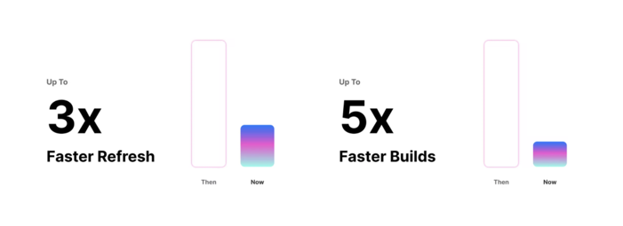
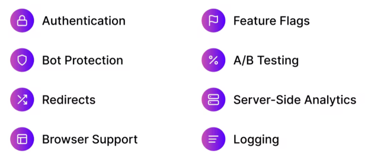

Next.js는 React의 SSR(Server Side Rendering)을 쉽게 구현할 수 있게 도와주는 간단한 프레임워크이다.
직접 React를 이용해서 SSR을 구현하기에 가능은 하지만, 생각보다 어렵고 복잡한 부분이 많다. 이러한 문제를 해결한것이 바로 Nextjs라는 프레임워크!

최근 release된 `Next.js`의 version 12의 몇가지 주목할만한 feature에 대해서 알아보자!
이 글은 간단히 요약한 내용이고, 더욱더 자세한 설명은 [공식블로그](https://nextjs.org/blog/next-12) 참조

## Rust Compiler
<div style="width: 60%;margin-bottom: 15px; margin-left:auto; margin-right: auto;">
  
</div>

compiler가 Rust로 변경되면서 프로젝트 빌드 속도가 3배, 코드 변경으로 인한 새로고침 속도는 5배 증가. [SWC](https://swc.rs/)라는 오픈 플랫폼을 사용한다.
사용하는 방법은 `next.config.js`에 해당 옵션을 추가하면 된다.
```javascript
module.exports = {
  swcMinify: true
}
```

## Middleware
코드레벨이 아닌 다양한 middleware를 구성하는 기능을 제공
<div style="width: 60%;margin-bottom: 15px; margin-left:auto; margin-right: auto;">
  
</div>

## React 18 support
지난 6월 facebook에서 발표했던 React18이 이번에 적용되면서 `Suspense`, `startTransition`, `lazy`와 같은 새로운 api를 사용하기 위한 준비를 하고 있다고 한다.

## React Server Component
Nextjs에서 제공하는 SSR 처리 방식인 `getServersideProps`, `getStaticProps` 등의 패턴이 없이 React Server Component를 사용하면 서버단 로직을 처리할 수 있다.
이제 별다른 처리 없이 `.server.js`이라고 파일명을 변경하면 SSR이 된다.
사용하는 방법은 `next.config.js`에 해당 옵션을 추가하면 된다.
```javascript
module.exports = {
  experimental: {
    concurrentFeatures: true,
    serverComponents: true
  }
}
```

## Image tag의 AVIF format support
다양한 image format중 가장 압축률이 높은 `AVIF`를 `Image` 태그의 옵션으로 사용할 수 있게 되었다.
```javascript
module.exports = {
  images: {
    formats: ['image/avif', 'image/webp']
  }
}
```

## URL Import
`npm` 또는 `yarn`의 명령어 없이, URL을 이용해 외부 module을 import할 수 있는 기능이고 아직 실험단계라고 한다.
```javascript
// 1번 방법.
module.exports = {
  experimental: {
    urlImports: ['https://cdn.skypack.dev']
  }
}

// 2번 방법.
import confetti from 'https://cdn.skypack.dev/canvas-confetti'
}
```

이상으로 간략하게 최신 Nextjs의 버전 12 업데이트에 대해서 살펴보았다. 여러 주목할만한 기능이 추가되었고, React에도 대응하고 있는 모습이 보인다.
특히 SSR에 대한 새로운 component가 등장하면서 Nextjs를 대표하는 feature였던 `getServersideProps`, `getStaticProps` 등이 점점 사라지게 될지도 모르겠다.

<p style="font-size:15px; float: right">이미지 출처: https://nextjs.org/blog/next-12</p>
