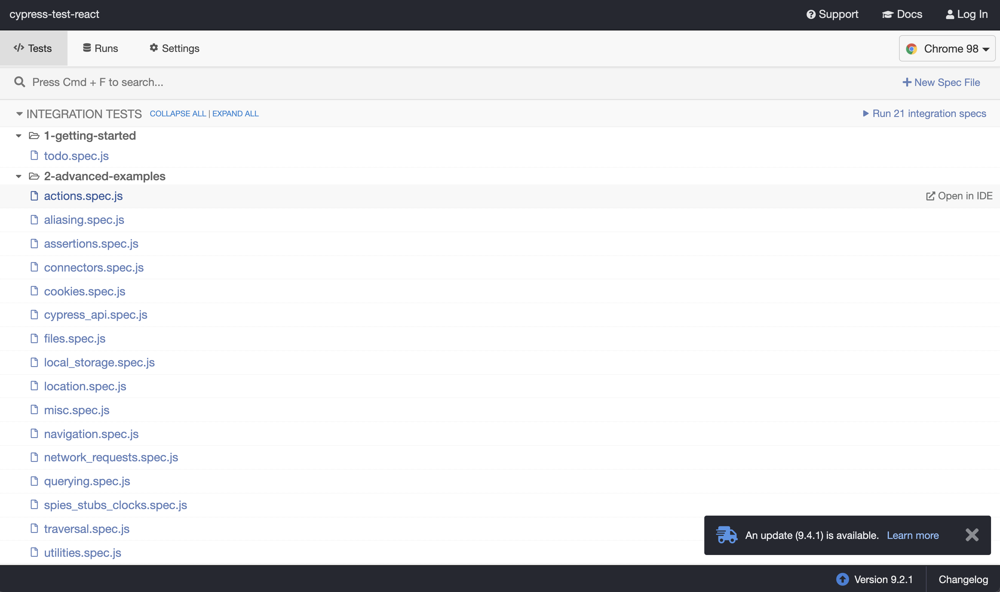
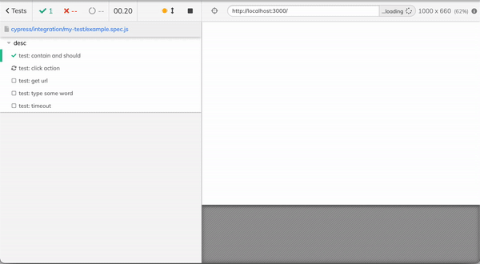

개발을 진행하면서 test를 한다는 것은 여러가지 의미를 가진다. 사실 개발을 진행하는 모든 일련의 프로세스가 test이다. 하지만 이러한 test를 좀더 세분화시키고, 의도대로 잘 작동하는지 한번더 검증하는 단계가 필요하다. 특히 새로운 기능을 추가하는 것이 아닌 기존의 code를 수정하게 되는 경우(예를 들어 리팩토링을 하는경우)에는 그 기능의 결과에는 영향을 미치지 않아야 하기 때문에 이때에는 test 단계에서 잘못된 부분을 catch할 수 있다. 
test를 그 목적에 따라 구분지으면 다음의 세가지 분류로 나눌 수 있다.(다음의 분류는 모든 test에 대한 엄격한 rule이 아니고, 다양한 상황이나 목적에 의해 더 세분화되기도 단순화되기도 한다) 

- <b><i>Unit Testing (유닛 테스트)</i></b> 
code가 개발자의 의도대로 작동하는지 확인하기 위해 개별 컴포넌트 또는 모듈을 독립적으로 확인하는 것 
- <b><i>Integration Testing (통합 테스트)</i></b> 
컴포넌트 또는 모듈이 그룹화되서 통합/결합 될때 잘 작동하는지 확인하는 것 
- <b><i>Functional Testing (기능 테스트)</i></b> 
서비스의 기능을 테스트하여 올바른 작업을 수행하는지 확인하는 것 
 

javascript로 작성된 프로젝트에 test code를 작성할 때에 사용할 수 있는 것들은 다양하다. 대표적으로 unit test를 작성할때 `jest`, `mocha`, `chai`등이 있다. 이들은 다 비슷한 목적을 가지고 있고 닮아있지만 다른 특성들을 가진다. 
나는 대부분의 test code를 작성할때, `react`로 짜여진 컴포넌트를 `jest` 기반의 라이브러리를 사용했던 경험이 있다.  
사용했던 testing library는 [enzyme](https://enzymejs.github.io/enzyme/), [react-testing-library](https://testing-library.com/docs/react-testing-library/intro/) 이 두 가지 이다.
하지만 위 두가지는 어려운점이 어떤 부분이 어떤 과정으로 testing 되는지 육안으로 확인하기 어렵다는 것이다. `snapshot` 기능을 이용해서 스타일링 코드를 확인할 수 있지만 실제로 어떤 과정을 거치는지 말이다. 그래서 한번 검토해본 것이 e2e testing tool중에 한 가지인 `cypress`이다.  
[Cypress](https://github.com/cypress-io/cypress)는 e2e test 뿐만아니라 unit test, integration test까지 사용이 가능하다. 가장 큰 장점중에 하나인 GUI를 지원하고, 스펙관리 및 디버깅이 편리하다. 좀더 scenario/user-oriented의 성격을 가지고 있는 tool이다. 
`cypress`를 접하면서 가장 매력적으로 다가왔던 부분은 바로 GUI이다. 내가 어떤식으로 test를 하고있고, test failure가 발생했을 경우에는 어디에서 발생했는지 log와 함께 표시된다.

  

참조
https://medium.com/welldone-software/an-overview-of-javascript-testing-in-2019-264e19514d0a
