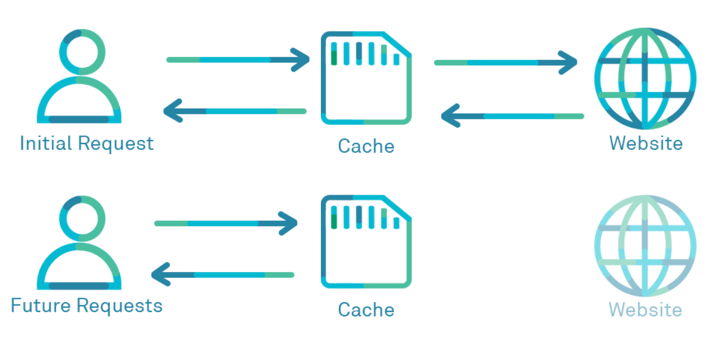

`Cache`는 컴퓨터 사이언스에서 data나 값을 복사해두는 임시 저장소를 가리킨다. 컴퓨터 사이언스에서 다루는 캐시는 여러가지 종류가 있지만 여기서는 `web cache`에 대해 알아보자.

  

***`web cache`*** 또는 ***`HTTP cache`***는 서버 지연을 줄이기 위해 웹 페이지, 이미지, 기타 유형의 웹 멀티미디어 등의 웹 문서들을 임시 저장하기 위한 정보기술이다. 웹 캐시 시스템은 이를 통과하는 문서들의 사본을 저장하며 이후 요청들은 특정 조건을 충족하는 경우 캐시화가 가능하다. 웹 캐시 시스템은 일종의 어플라이언스나 컴퓨터 프로그램을 의미할 수 있다. 동일한 서버에 다시 접근할 때에는 근처에 있는 프록시 서버의 웹 캐시에 저장된 정보를 불러오므로 더 빠른 열람이 가능하다 출처:<a href="https://ko.wikipedia.org/wiki/%EC%9B%B9_%EC%BA%90%EC%8B%9C" target="_blank">위키피디아</a>

`web cache`는 적용 대상에 따라 다음과 같이 나눌 수 있다.
1. ***Browser Cache***  
✔ ︎웹 브라우저 또는 HTTP 요청을 하는 client에 의해 캐시되는것  
✔ 개인에 한정  
✔ 웹 브라우저 back button 또는 이미 방문한 페이지를 재방문 하는 경우
2. ***Proxy Cache***  
✔ Browser Cache와 동일한 원리로 동작하며 네트워크 상에서 동작  
✔ 네트워크 대역을 효율적으로 사용하는것과 특정 웹사이트에 대한 액세스 제한의 목적  
3. ***Gateway Cache***  
✔ 서버 앞단에 설치되어 있으며 요청에 대한 캐싱 및 효율적인 분배를 통해 성능향상  
✔ load balancing, SSL acceleration, compression 등을 수행  
✔ 무한대의 client들에게 한정된 수의 웹 서버 컨텐츠 제공

### 검증 헤더와 조건부요청
client에서 서버로 요청을 할 경우 서버에서 기존데이터를 변경했거나 하지 않은 두가지 상황이 있을 수 있다. 변경된 경우에는 새롭게 다운로드하여 cache를 갱신하는게 합리적이지만, 변경이 없다면 굳이 다운로드가 필요없다. 이럴때 사용되는것이 검증헤더와 조건부 요청이다.   
처음 응답시 `Last-Modified`라는 header를 넣어 데이터가 마지막에 수정된 시간을 확인 할 수 있다.  
cache 저장 시간이 지난 후 요청을 보낼때 최종 수정일을 `if-modified-since`라는 header에 넣어서 보낼 경우, 서버에서는 최종 수정일을 비교하게 되고 데이터의 변경유무를 확인하게 된다. 변경이 없을 경우 `304(Not Modified)` 응답을 보내며 client는 이 응답을 확인 뒤 cache를 다시 사용한다.

### Cache-Control policy
`public`: 요청이 거쳐가는 모든 서버가 cache를 할 수 있다.  
`private`: 요청이 거쳐가는 모든 서버가 아닌 end-to-end의 브라우저만 cache를 저장할 수 있다. (모든 cache-control policy는 *private*을 default로 한다)  
`s-maxage`: proxy cache에만 적용되는 `max-age`  
`max-age`: cache가 유효한 시간을 지정 (second 단위). * 한번 브라우저에 cache가 저장되면 만료될때까지 계속 브라우저에 남아있게 된다.  
`no-cache`: `max-age=0`과 동일. 저장은 하지만 사용할때마다 재검증을 요청한다.  
`no-store`: cache를 하지 않을때 사용한다. `no-cache`와 차이점은 저장을 하지 않는다는것.

### CDN
`CDN` 이란 `Content Delivery Network`의 약자로, proxy 서버에 기반한 web cache의 cloud화 라고 할 수 있고, 전세계 사용자들에게 빠르고 효율적으로 contents를 제공하기 위해 등장했다. CDN은 각 지역에 cache 서버(PoP, Points of presence)를 분산 배치해, 근접한 사용자의 요청에 원본 서버가 아닌 cache 서버가 응답을 전달한다.  
`CDN`은 캐시서버를 이용하기 때문에, 예를들어 같은 파일명에 대해 image를 다시 upload 하는 경우 새로운 내용을 인식하지 못하여 실제로 변경 image가 잘 반영되지 않는 이슈가 있다. 이 때, image 파일 들에 대해 새로 cache를 refresh 하는 동작을 `purge`라고 한다.
