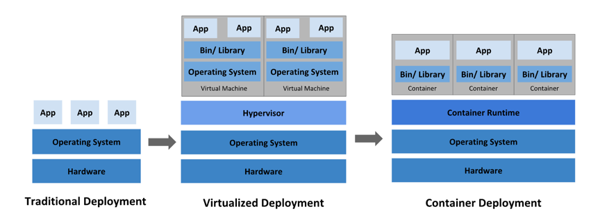

`Kubernetes` 쿠버네티스는 컨테이너화된 워크로드와 서비스를 관리하기 위한 이식성이 있고, 확장가능한 오픈소스 플랫폼이다. 쿠버네티스는 선언적 구성과 자동화를 모두 용이하게 해준다. 쿠버네티스는 크고, 빠르게 성장하는 생태계를 가지고 있다. 쿠버네티스 서비스, 기술 지원 및 도구는 어디서나 쉽게 이용할 수 있다.
<span style="font-size: 12px;">(쿠버네티스란 명칭은 키잡이(helmsman)나 파일럿을 뜻하는 그리스어에서 유래했다. K8s라는 표기는 `K`와 `s`와 그 사이에 있는 8글자를 나타내는 약식 표기이다. 출처: <a href='https://kubernetes.io/docs/concepts/overview/what-is-kubernetes/' target='_blank' rel='noopener noreferer'>공식사이트</a>)</span>

### 배포 아키텍쳐의 변화 
<div style="width: 70%;margin-bottom: 15px; margin-left:auto; margin-right: auto;">
  
  <div style="width:80%;margin-left:auto; margin-right: auto;font-size:10px;color:#8b9196">출처: https://kubernetes.io/docs/concepts/overview/what-is-kubernetes/</div>
</div>

- **전통적인 배포**: 초기 조직은 애플리케이션을 물리 서버에서 실행했었다. 한 물리 서버에서 여러 애플리케이션의 리소스 한계를 정의할 방법이 없었기에, 리소스 할당의 문제가 발생했다. 예를 들어 물리 서버 하나에서 여러 애플리케이션을 실행하면, 리소스 전부를 차지하는 애플리케이션 인스턴스가 있을 수 있고, 결과적으로는 다른 애플리케이션의 성능이 저하될 수 있었다.
- **가상화 배포**: 이는 단일 물리 서버의 CPU에서 여러 가상 시스템 (VM)을 실행할 수 있게 한다. 가상화를 사용하면 VM간에 애플리케이션을 격리하고 애플리케이션의 정보를 다른 애플리케이션에서 자유롭게 액세스 할 수 없으므로, 일정 수준의 보안성을 제공할 수 있다.   
- **컨테이너 배포**: 컨테이너는 VM과 유사하지만 격리 속성을 완화하여 애플리케이션 간에 운영체제(OS)를 공유한다. 그러므로 컨테이너는 가볍다고 여겨진다. VM과 마찬가지로 컨테이너에는 자체 파일 시스템, CPU 점유율, 메모리, 프로세스 공간 등이 있다. 기본 인프라와의 종속성을 끊었기 때문에, 클라우드나 OS 배포본에 모두 이식할 수 있다.

### 용어정리
`Master` 보통 master node를 말하고 Docker daemon을 관리   
`Worker` docker가 설치되어 있고 실제 컨테이너들이 생성되어 있는 node  
`Pod` kubernetes의 기본단위. 컨테이너 또는 컨테이너 묶음이다 (하나의 pod안에 복수의 컨테이너도 생성이 가능하다)  
`Replicaset` pod를 자동으로 생성/복제 관리해주는 controller (안정성을 보장)    
`Label` pod를 그룹핑하여 식별하도록 하는 이름표  
`Service` label에 따라 하나의 서비스를 생성해 외부에서 접근할수 있도록 하는 어플리케이션  
`Deployment` pod와 Replicaset에 대한 선언과 업데이트를 관리해주는 모듈  

### 기본 yaml template
```yaml
apiVersion: v1
kind: Pod
metadata:
  name: nginx
spec:
  containers:
  - name: nginx
    image: nginx:1.7.9
    ports:
    - containerPort: 8090
```
1. 띄어쓰기 구분을 잘 해야한다. 각 상위-하위 구분을 띄어쓰기로 하기 때문에 틀릴경우 적용이 되지 않는다.
2. 원하는 종류 (`kind`)에 따라 `apiVersion`이 달라진다. (추가적인 apiVersion의 종류와 kind는 <a href='https://kubernetes.io/docs/reference/generated/kubernetes-api/v1.23/#-strong-api-overview-strong-' target='_blank' rel='noopener noreferer'>공식문서 참고</a>)
