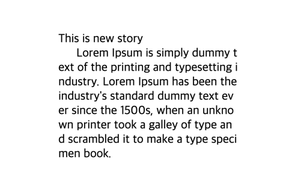

frontend 개발자로서 가장 많이 하는 작업중 하나는 바로 styling 작업일 것이다. (내가 제일 재밌어하는 작업중에 하나이다)  
styling시 css를 이용하여 구현을 하게되는데 css도 많은 문법과 tip을 가지고 있다. 이 포스트에서는 몇가지 유용한 tip들을 소개해보려 한다!  

#### text-indent
문단에서 첫번째 줄만 indentation(들여쓰기)을 하고싶을때 사용할 수 있다.
```css
    p {
        margin-bottom: 0
    }

    p + p {
        width: 300px;
        word-break : break-all;
        text-indent: 1.5em;
        margin-top: 0
    }
```
```html
<p>This is new story</p>
<p>
    Lorem Ipsum is simply dummy text of the printing and typesetting industry. Lorem Ipsum has been the industry's 
    standard dummy text ever since the 1500s, when an unknown printer took 
    a galley of type and scrambled it to make a type specimen book.
</p>
```
<div style="width: 50%;margin-bottom: 15px; margin-left:auto; margin-right: auto; ">
  
</div>
