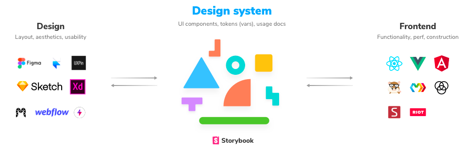

요즘 프론트엔드 개발자들을 뽑는 스타트업이나 기업들의 채용 job description에서 빠지지 않고 등장하는 한가지 문구가 있다.  
바로 `design system` 에 관한 내용이다. 대부분 design system을 가지고 있고 (아닐수도있다..) 프론트엔드 개발자가 구축을 할것이다. 
나 또한 현재 재직중인 회사에서 자체 design system을 구축해서 사용하고 있고 ui의 통일성을 유지하고 있다. 이번 포스팅에서는 design system을 개발하면서 느꼈던 (개발자입장에서의) 몇가지 생각을 정리해보려고 한다.  
일단 나는 design system을 구축한다는것 자체가 좋은 시작점이 될 수 있다고 생각한다. 개발자의 입장에서 생각해보았을때 통일된 ui를 바라보는것이 얼마나 `easy on eyes`한 것인지 알것이다.
특히 코드를 작성하는 스타일이 각 개발자마다 각양각색이므로 동일한 버튼을 만들때 구현방식이 달라질 수 있다. 예를들어 A 개발자는 `button`을 사용하여 `semantic`한 property를 그대로 가져가려고 하는 반면, B 개발자는 `div`와 `:hover`를 이용해 버튼 형태만 구현하는데 초점을 맞출 수도 있다.
이런 면에서 일단 design system을 구축하면 *코드의 통일성과 간결성*을 지킬 수 있다. 물론 개발 시 작성하게 되는 코드의 양도 현저하게 줄어들 것이다. 우리가 많이 사용되는 컴포넌트를 공통 컴포넌트로 만들어 `export`로 사용하듯이 button design system 컴포넌트 하나로 인해 A와 B 개발자는 동일한 스펙의 동일한 버튼을 몇줄 안되는 코드로 작성할 수 있을 것이다. 코드 통일성을 해치지 않으면서 말이다.  
그 다음으로 design system을 도입하게 되면 디자이너의 시각을 이해하게 된다. 사실 프론트엔드 개발자로 업무를 진행하면서 `ui/ux`를 배제하고 개발을 할 수는 없을 것이다. 그러한 면에서 디자이너들의 협업하는 것이 어쩌면 효율성에만 집중해 있는 개발자들의 시각에 새로운 관점을 얹어줄 수도 있다. 실제로 디자이너들과 협업을 진행하면서 시나리오의 작은 부분이라도 `ui/ux`적으로 `user friendly`하게 풀어내는 디자이너들의 작업 결과물을 보면 내가 가지고 있는 디자인적 개념이 얼마나 부족했는지 알았던 적이 많다. 
디자이너들에게도, 개발자들에게도 서로 협업하면서 서로의 새로운 관점을 배울 수 있는 `win-win` 작업이 될 수 있다.  
또한 design system 컴포넌트를 개발하면서 `library`로 쉽게 쉽게 가져와서 사용한 컴포넌트들의 구현방식과 동작을 직접구현할 경우 많은 공부가 되기도 하였다. 
특히 `modal`을 직접 구현하면서 `createPortal`이라는 메소드를 사용하거나, `group check box`를 구현하면서 실제 `raw-level`의 `react element`를 control해보는 등의 작업이 그렇다. 이 부분은 회사마다, 그리고 개발자의 스타일마다 다르겠지만 컴포넌트를 개발할 때 다른 `library`를 가져오지 않고 직접 구현해보면서 개발 실력을 향상 시킬 수 있는 계기가 되기도 했다. 물론 필요한 부분은 가져다 쓰는것이 비용적으로 더 효과적인 방법일수도 있을테니 이는 상황에 따라 적절하게 선택하면 되겠다. (하지만 나는 직접 구현해보는것을 추천). 비슷한 맥락에서 design system을 만들때에 필요한  다양한 `tool`을 접할 수 있는 기회도 되었다. `figma`, `framer`, `zeplin`, `storybook` 등 design system을 개발하는데 어느정도 100%는 아니지만 정형화된 `tool`이나 `application`들이 있기 때문에 이를 사용해볼 수 있었다.  
 

  

이미지출처 https://storybook.js.org/tutorials/design-systems-for-developers/react/ko/introduction/

 

나 또한 design system을 구축하면서 `storybook`을 처음 사용해보았고, 지금도 사용중이다.  
이렇게 보면 새로운것을 도입하고 효율적으로 개발할 수 있고, 개발능력 향상에도 도움이 되는 design system을 도입하지 않을 이유가 없다고 생각하지만 결코 장점만 있는것은 아니다.  
첫번째로 커뮤니케이션 비용이 꽤 많이 든다는 점을 들수 있겠다. 작은것 하나가 변경되더라도 디자이너와 개발자 모두 협의를 거쳐야하고 (추후 align 되지 않아 서로 욕하는 사태를 막기위해), 디자이너들은 아주 작은 `1px`이라도 변경이 될 경우 개발자들에게 이를 수정해달라고 수정요청을 해야한다. 생각보다 이렇게 디자인과 개발현황을 공유하는것이 시간과 노력이 많이 들었다. (현재도 들고있다). 몇명씩 모여서 진행을 하더라도 결국 다같이 공유가 되어야하기 때문에 시간이 드는건 동일하다. 
이러한 노력의 과정이 없이 좋은 결과물을 바라는것 자체가 아이러니일 수 있으니 효율성 증대를 위한 투자를 하는것이라고 생각하자.
