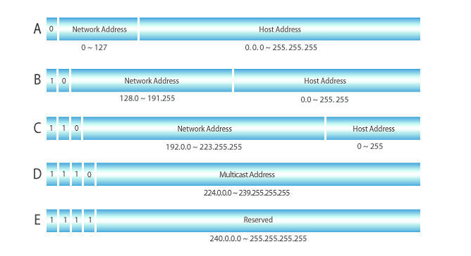

내가 참조하기 위해 작성하는 네트워크 필수 용어 및 설명

### Javascript window location object
<b>예시: http://www.example.com:8080/search?q=devmo#test </b>

`hash` 주소값에 붙어있는 anchor값 반환 ex) #test  
`hostname` URL의 도메인 반환 ex) www.example.com  
`href` URL 전체 반환 ex) http://www.example.com:8080/search?q=devmo#test  
`origin` 프로토콜 + URL의 도메인 + 포트 ex) http://www.example.com:8080        
`pathname` URL 경로 반환 ex) /search                                          
`port` 서버 포트 반환 ex) 8080  
`protocol` 프로토콜 반환 ex) http:  
`search` URL에 붙은 매개변수 반환(물음표 뒤의 값) ex) ?q=devmo  
`sub domain` 호스트, 서브 도메인으로 불리기도 한다. 보조 도메인으로써 URL로 전송하거나 계정 내의 IP주소나 디렉토리로 포워딩되는 도메인 이름의 확장자 ex) www  
`Top-level domain` 도메인 레벨 중에 가장 높은 단계에 있는 도메인. 도메인의 목적, 종류, 국가를 나타낸다. ex) com  
`domain name` 임의로 지정할 수 있는 사이트의 이름. 익히 알고 있는 google, naver, daum 등 사용자에게 쉽게 기억될 수 있도록, 보통 서비스명으로 도메인명을 지정해 사용한다. ex) example

### IP address (Internet Protocol address)
IP는 `0.0.0.0` 부터 `255.255.255.255` 까지 총 (`2^32`, `4,294,967,296`개)를 표현할 수 있다. 전세계 사람들에게 IP를 효율적으로 할당하기 위해 각 용도에 맞게 클래스로 나누어 IP 대역을 구분한다.  
클래스는 총 5개 `A, B, C, D, E` 가 존재한다. 흔하게 사용되는건 `A, B, C`이며 `D`와 `E`는 각각 멀티캐스트용도, 기타목적으로 예약된 클래스로 실제 IP주소가 할당되지는 않는다.

  

• Network address: 네트워크를 식별하기 위한 그룹 
• Host address: 개인 (네트워크의 호스트 컴퓨터를 식별)

 

-<b> A 클래스 (네트워크 영역 : `8`비트  / 호스트 영역 : `24`비트)</b>  
대규모 네트워크이므로 한 개의 네트워크 영역 당 가장 많은 IP주소를 할당할 수 있다.  
만약 `22.0.48.2` 라는 IP주소가 존재할 경우 기본적으로 네트워크 영역은 `22`고 호스트 IP는 `0.48.2`이다.
그리고 네트워크 영역이 `22`로 시작되는 IP를 `16,777,216-2`개 할당할 수 있다. 2개를 제외한 이유는 IP 주소는 처음인 `22.0.0.0`과 마지막 `22.255.255.255`를 사용하지 않기 때문.
모든 주소의 시작은 네트워크 주소로 사용되고 마지막은 브로드캐스트 주소로 사용된다.

-<b> B 클래스 (네트워크 영역 : `16`비트 / 호스트 영역 : `16`비트)</b>  
중규모 네트워크이고 네트워크 영역의 범위는 16비트.
`130.130.130.1` 라는 IP가 존재할 경우 네트워크 영역은 `130.130`이고, 호스트 IP는 `130.1`이 됩니다.
그리고 `130.130` 네트워크 영역의 할당 가능한 IP의 수는 `65,536-2`개 이다.

-<b> C 클래스 (네트워크 영역 : `24`비트 / 호스트 영역 : `8`비트)</b>  
소규모 네트워크이고, 네트워크 영역의 범위는 24비트이다.  
`221.3.0.1` 이라는 IP가 존재할 경우 네트워크 영역은 `221.3.0`이고, 호스트 IP는 `1`이 된다.
그리고 `221.3.0` 네트워크 영역의 할당 가능한 IP 수는 `256-2`개.

### CIDR 표기법
`Classless Inter-Domain Routing`의 줄임말로 클래스가 없는 라우팅 기법이라는 뜻이다. CIDR가 나오면서 클래스 시스템 보다 더 유연하게 IP 주소를 여러 영역으로 관리할 수 있게 되었다. 사용법은 CIDR block number를 ip 뒤에 붙여준다 ex) `10.0.2.0/24`
설명은 이렇다. `IP` 주소가 만약 `10.0.1.0/16` 이라고 할때, CIDR block이 `/16` 이므로 앞에서부터 <b>16번째</b>까지 ip 주소가 같은 CIDR 그룹을 만든다.  
> <b>00001010 . 00000000</b> . 00000001 . 00000000  

그럼 `10.0.1.0/16` 의 CIDR 그룹은 `10.0.0.0` 부터 `10.0.255.255` 가 된다.  
`10.1.0.0` 은 16번째 자리의 값이 다르기 때문에 CIDR 그룹에 포함되지 않는다.
> <b>00001010 . 0000000<i style='color:blue;'>1</i></b> . 00000001 . 00000000  

 
참조 
https://www.nakjunizm.com/2020/01/29/Cidr/
