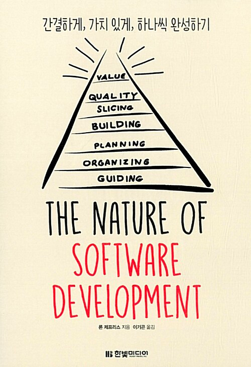

 
오랜만에 읽는 개발관련 도서. 개발자로서 많이 생각해보지 못한 성공적인 소프트웨어 개발에 대한 거시적인 관점을 이야기 해준다.  
**The Nature of software development  (저자 Ron Jeffries)**

  

개발자로 일하면서 다양한 사람과 프로젝트를 수행하게 된다. 그중에 `PM`(Project Manager)과 가장 많은 소통을 할 거라고 생각한다. (최근에는 `PO`(Product owner) 라고도 불린다.)  
그리고 꼭 PM의 직무가 아니더라도 소프트웨어 개발에 있어서 어떤 방향성을 가지고 목표를 향해 함께 나아가야 되는지 아주 구체적인 방법을 알려주는 책인것 같다.  
최근 애자일 (`Agile`) 방법론이 급부상하면서 이 책에서도 애자일에 기반한 소프트웨어 개발 방법을 알려주고 있다. 몇가지 인상깊었던 부분들을 꼽아보도록 하겠다.  
 

작고 가치있는 feature를 자주 배포할 때 최고의 가치를 얻을 수 있습니다. - 본문 내용중

책에서는 우선 자주자주, 작게작게 라는 부분을 강조하고 있다. 그리고 그 규모를 정하는 기준은 프로젝트를 수행하는 모든 사람들의 의견을 반영해야한다고 말한다. 우선 우리가 원하는것, 그리고 유저들이 원하는것을 '가치'라고 표현하고 있고 <u>**소프트웨어를 배포할 때 비로소 가치는 생겨난다**</u> 라고 말한다. 사용자 대다수는 모든 기능을 사용하지도 않고 모든 기능을 원하는 사용자도 없다고 강조한다. 가치있는 부분으로 나누어서 배포하는 것을 강조한다. 제품의 작은 부분부분을 일찍 배포하면 프로젝트가 올바른 방향으로 나아가고 있는지 확인 할 수 있다고 한다. 이부분을 읽으며 많은 공감이 되었다.  
<u>작은 부분을 우선 배포하고, 사용자들에게 공개하면 사용자들은 새로운 기능을 빠르게 접해볼 수 있고 우리는 피드백 또한 빠르게 받아볼 수 있다</u>. 물론 배포된 모든 제품이 성공(여기서 성공과 실패라는 표현이 맞는지는 모르겠지만..)하리라는 보장은 없다. 만약 실패했더라도 적은 비용으로 제품의 방향을 수정할 수 있는 것이다.

활동을 기반으로 한 제품은 100kg짜리 돌덩어리와 같습니다. - 본문 내용중

커다한 프로젝트가 잘못되어가고 있을때, 막바지에 들어서면 비용을 줄일 방법이 거의 없다. 모든 작업이 시간만 소비한 결과물이 되는것이다. 만약 프로젝트를 진행할때 진실을 알았더라면 불필요한 작업은 연기했을 것이다. 모든 기능을 한꺼번에 계획하고 한꺼번에 개발하는 일은 모두를 힘들게 한다. 그러므로 <u>처음부터 여러 배포일정을 계획하는것이 중요하다</u>. 배포일정을 여러번으로 계획하면 가치를 빠르게 전달할 수도 있고, 프로젝트를 관리하기도 쉽다. 이렇게 작은 기능으로 계획한 이유는 개발팀에도 중요한 요소가 된다. 개발팀은 일정한 작업속도를 유지하는 것이 가장 큰 효율을 내므로 이에 맞춰서 프로젝트를 관리할 수 있는 것이다. 보통 1~2주를 하나의 주기(`sprint`)로 잡고, 2~3일 정도 작업할 분량일 때 가장 좋은 퍼포먼스를 낼 수 있다고 말한다. <b>자주 계획하고, 다음에 할일을 정하는 것이 중요하다는것이다.</b> 
현재 회사에서 진행중인 프로젝트는 보통 큰 기능단위로 1달을 주기로 배포 계획을 잡고 있다. 그 주기를 조금만 줄여본다면 책에서 제시한 방법에 근접하게 수행해볼수도 있을것 같다.

