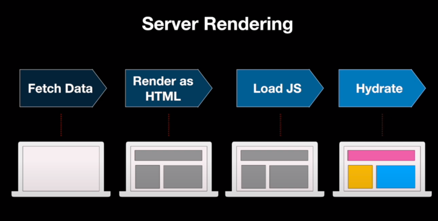

<div class="quote">In web development, hydration or rehydration is a technique in which client-side JavaScript converts a static HTML web page, delivered either through static hosting or server-side rendering, into a dynamic web page by attaching event handlers to the HTML elements.</div>

`Hydration`은 우리말로 직역하면 수화, 수분보충 등으로 번역될 수 있다. 어떻게 보면 아주 직관적인 단어라고 할 수 있을 것이다. `React`에서 `hydration`이라는 용어는 왜 사용되고 어떤 역할을 하는지 알아보도록 하자.  
`React`는 `DOM`에 컴포넌트를 렌더링 해주는 `render`라는 메소드를 제공해주고 있다.
```javascript
ReactDOM.render(element, container, [callback]);
```
이 `render`함수는 `container`의 자식으로 react component를 넣게되는데, 기존에 이미 `rendering`된 react component가 있다면 새로 렌더링 하는게 아니고 update만 진행해준다. 그리고 rendering이 완료되면 세번째 파라미터로 전달된 `callback`이 실행되게 할 수 있다.

```javascript
ReactDOM.hydrate(element, container, [callback]);
```
`hydrate()` 함수는 특정 컴포넌트를 두번째 파라미터인 지정된 `DOM`요소에 하위로 `hydrate`처리만 한다. 이는 `rendering`을 통해 새로웁 웹 페이지를 구성할 `DOM`을 생성하는것이 아니라, 기존 `DOM Tree`에서 해당되는 `DOM`요소를 찾아 정해진 `javascript`속성 (ex)`event listerner`)들만 매핑하겠다는 말이다. 즉, `rendering`은 하지않고 `event handler`만 붙여준다.  
*`Server side rendering`을 해서 이미 `mark up`이 완성되어있는 경우에는 굳이 `render`를 사용할 필요가 없다. 이때 `hydrate`으로 함수들만 붙여주는 것이다.*

<div style="width: 75%;margin-bottom: 15px; margin-left:auto; margin-right: auto;">
  
</div>

`SSR`의 동작 순서를 보자. `server`는 완성된 `HTML`을 내려준다. 그리고 나서 `JS`실행이 되면서 `react`가 `HTML`과 `store`를 `react component`와 `store`로 변환하는 과정이 일어나는데 이를 `hydrate`라고 한다. 메마른 화면에 상호작용과 `event handler`로 수분보충을 통해 동적인 상태로 변화한 것이다. 하지만 이때 `hydrate`가 일어나면서 불필요한 화면이 그려지는 현상이 발생한다. 이미 `server`에서 완성된 `HTML`이 내려온 것을 `react`는 알지 못하기 때문이다. 그래서 `SSR`을 하는 경우에는 `ReactDOM`의 `hydrate`메소드를 사용해야 한다.  
(`server`에서 한번 `rendering`하고 `client`에서 한번 더 `rendering`하면 비효율적인 방식이 아닌가 생각할 수 있다. 하지만 `server`단에서 빠르게 `rendering`을 하고 유저에게 빠른 웹 페이지로 응답할 수 있다는 것에 더욱 큰 이점을 가져갈 수 있다. 이때 `pre-rendering`한 `DOM`들은 모든 `JS` 상호작용이 빠진 굉장히 가벼운 상태이므로 더욱 빠른 로딩이 가능하다)

`react`는 `server`와 `client`에서 `rendering`되는 컨텐츠가 동일할 것이라 예상한다. 개발모드에서 `react`가 `hydration`중 불일치에 대해 warning을 보여주는 모습을 가끔씩 경험해보았을 것이다. 


<br/>
<div style="font-size:10px;color:#8b9196;word-break: break-all;">
<b>이미지 및 내용 출처</b><br/>
- https://ko.reactjs.org/docs/react-dom.html<br/>  

</div>


