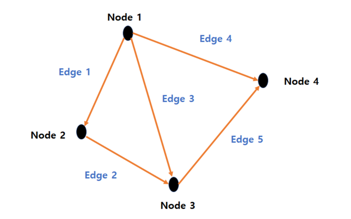

DFS(`Depth-First Search`) 깊이 우선 탐색, BFS(`Breadth-First Search`) 너비 우선 탐색 모두 `graph`를 탐색하는 방법이다. 알고리즘에서 `graph`란, `node`와 그 `node`를 연결하는 `edge`로 이루어진 자료구조를 말하며, 이를 탐색한다는 것은 하나의 `node`에서 시작해 `edge`로 연결된 차례대로 모든 `node`를 한번씩 방문하는 것을 말한다.

Node와 Edge로 구성된 Graph

DFS는 탐색 `graph`의 최초의 `node`를 확장하여 목표 상태가 발견될 때까지 더 깊이 확장하는 <a href='https://ko.wikipedia.org/wiki/%EB%A7%B9%EB%AA%A9%EC%A0%81_%ED%83%90%EC%83%89' target='_blank' rel='noopener noreferer'>맹목적 탐색 (Blind search)</a>이다. 만일 자식`node`를 갖고 있지 않은 `node`에 이르면 `back-tracking`하여 다음 `node`에서 출발한다. 

 

<b>내용 출처</b> 
- https://en.wikipedia.org/wiki/Depth-first_search   

