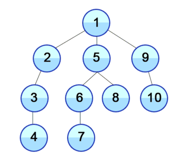
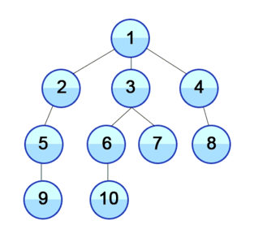
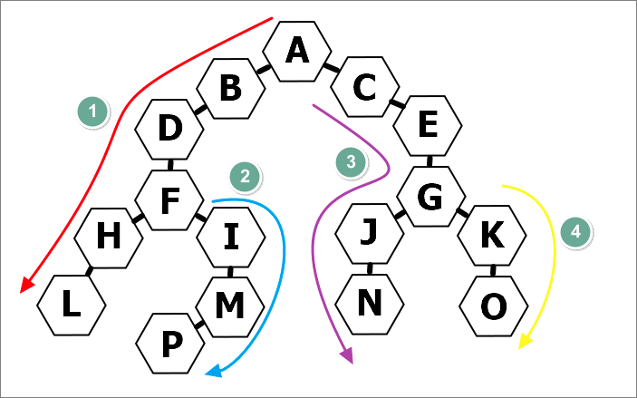
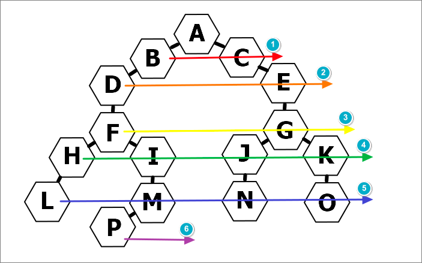

DFS(`Depth-First Search`) 깊이 우선 탐색, BFS(`Breadth-First Search`) 너비 우선 탐색 모두 `graph`를 탐색하는 방법이다. 알고리즘에서 `graph`란, `node`와 그 `node`를 연결하는 `edge`로 이루어진 자료구조를 말하며, 이를 탐색한다는 것은 하나의 `node`에서 시작해 `edge`로 연결된 차례대로 모든 `node`를 한번씩 방문하는 것을 말한다.
<div style="width: 50%;margin-bottom: 15px; margin-left:auto; margin-right: auto;">

<div style="width:200px;margin-left:auto; margin-right: auto;font-size:13px; color:#8b9196">Node와 Edge로 구성된 Graph</div>
</div>

### Depth-First Search (DFS: 깊이 우선 탐색)
<div style="width:30%;margin-bottom: 15px; margin-left:auto; margin-right: auto;">

</div>

`DFS`는 탐색 `graph`의 최초의 `node`를 확장하여 목표 상태가 발견될 때까지 더 깊이 확장하는 <a href='https://ko.wikipedia.org/wiki/%EB%A7%B9%EB%AA%A9%EC%A0%81_%ED%83%90%EC%83%89' target='_blank' rel='noopener noreferer'>맹목적 탐색 (Blind search)</a>이다. 만일 자식`node`를 갖고 있지 않은 `node`에 이르면 `back-tracking`하여 다음 `node`에서 출발한다. 즉, 시작점 부터 다음 분기로 넘어가기 전에 해당 분기를 완벽하게 탐색하고 넘어가는 방법이다.  
`DFS`는 다음과 같은 몇가지 특징을 가진다    

- 자기 자신을 호출하는 순환 알고리즘 형태를 가진다
- 전위순회를 포함한 다른 형태의 트리 순회는 모두 `DFS`의 한 종류이다
- 단순 검색 속도는 너비 우선 탐색(`BFS`) 보다 느림
- 구현 시 `graph`탐색의 경우 어떤 `node`를 방문했었는지 여부를 반드시 검사해야 한다 (그렇지 않을 경우 무한루프 주의!)
- `Recursion` 또는 `Stack`을 이용하여 구현 가능하다

<h5>DFS의 시간 복잡도</h5>

- 인접 리스트로 표현된 그래프: `O(N+E)`
- 인접 행렬로 표현된 그래프: `O(N^2)`
- 그래프 내에 적은 숫자의 간선(`edge`)만을 가지는 희소 그래프(Sparse Graph) 의 경우 인접 행렬보다 인접 리스트를 사용하는 것이 유리하다.


### Breadth-First Search (BFS: 너비 우선 탐색)
<div style="width: 30%;margin-bottom: 15px; margin-left:auto; margin-right: auto;">

</div>

`BFS`란 너비 우선 탐색이라고도 불리며 `graph`에서 시작 `node`에 인접한 `node`부터 탐색하는 알고리즘이다. 시작 `node`로부터 가까운 `node` 먼저 방문하고 멀리 떨어져 있는 `node`를 나중에 방문하는 방식으로 순회함으로써 노드를 넓게(wide) 탐색한다. 주로 두 `node` 사이의 최단 경로 혹은 임의의 경로를 찾고 싶을 때 이 방법을 사용한다.
`BFS`는 다음의 특징을 가진다

- 직관적이지 않다는 단점이 있다 
- 재귀적으로 동작하지 않는다
- 구현시 어떤 `node`를 방문했었는지 여부를 반드시 검사해야 한다
- `Queue`를 이용하여 구현가능하다 
- <a href='https://ko.wikipedia.org/wiki/%ED%94%84%EB%A6%BC_%EC%95%8C%EA%B3%A0%EB%A6%AC%EC%A6%98' target='_blank' rel='noopener noreferer'>Prime algorithm(프림 알고리즘)</a>,  <a href='https://ko.wikipedia.org/wiki/%EB%8D%B0%EC%9D%B4%ED%81%AC%EC%8A%A4%ED%8A%B8%EB%9D%BC_%EC%95%8C%EA%B3%A0%EB%A6%AC%EC%A6%98' target='_blank' rel='noopener noreferer'>Dijkstra algorithm(다익스트라 알고리즘)</a>과 유사하다 

 
<h5>BFS의 시간 복잡도</h5>

- 인접 리스트로 표현된 그래프: `O(N+E)`  
- 인접 행렬로 표현된 그래프: `O(N^2)`  
- 깊이 우선 탐색(`DFS`)과 마찬가지로 그래프 내에 적은 숫자의 간선(`edge`)만을 가지는 희소 그래프(Sparse Graph) 의 경우 인접 행렬보다 인접 리스트를 사용하는 것이 유리하다

<br/>

---

### 구현예제

```javascript
const graph = {
  A: ["B", "C"],       B: ["A", "D"],   C: ["A", "E"],
  D: ["B", "F"],       E: ["C", "G"],   F: ["D", "H", "I"],
  G: ["E", "J", "K"],  H: ["F", "L"],   I: ["F", "M"],
  J: ["G", "N"],       K: ["G", "O"],   L: ["H"],
  M: ["I", "P"],       N: ["J"],        O: ["K"],
  P: ["M"]
};
```

<div style="width: 40%;margin-bottom: 15px; margin-left:auto; margin-right: auto;">

<div style="width:130px; margin-left:auto; margin-right: auto;font-size:15px; color:#8b9196; margin-top: 5px; font-style: italic">DFS(깊이우선탐색)</div>
</div>

```javascript
const dfs = (graph, start) => {

    const checked = [];    // 탐색 완료 데이터
    const willCheck = [];  // 탐색 예정 데이터
    
    willCheck.push(start);
    
    while(willCheck.length!==0){
      const node = willCheck.pop();  // 스택(Last In First Out)
      if(!checked.includes(node)){
            checked.push(node);
         //reverse() 제거 시 그림의 4,3,2,1 순서로 탐색     
           willCheck.push(...graph[node].reverse());  
        
      }
   }
    return checked;
}

console.log(dfs(graph, "A"));
// ['A', 'B', 'D', 'F', 'H', 'L', 'I', 'M', 'P', 'C', 'E', 'G', 'J', 'N', 'K', 'O']
```

<br/>


<div style="width: 40%;margin-bottom: 15px; margin-left:auto; margin-right: auto; ">

<div style="width:130px; margin-left:auto; margin-right: auto;font-size:15px; color:#8b9196; margin-top: 5px; font-style: italic">BFS(너비우선탐색)</div>
</div>

```javascript
const bfs = (graph, start) => {
  const checked = [];
  const willCheck = [];

  willCheck.push(start);

  while(willCheck.length!==0){
    const node = willCheck.shift(); // 큐(First In First Out)
    if(!checked.includes(node)){
      checked.push(node);
      willCheck.push(...graph[node]);
    }
  }
  return checked;
}
console.log(bfs(graph, "A"));
// ['A', 'B', 'C', 'D', 'E', 'F', 'G', 'H', 'I', 'J', 'K', 'L', 'M', 'N', 'O', 'P']
```

<br/>
<div style="font-size:11px;color:#8b9196;word-break: break-all;">
<b>내용 출처</b><br/>
- https://ko.wikipedia.org/wiki/%EB%84%88%EB%B9%84_%EC%9A%B0%EC%84%A0_%ED%83%90%EC%83%89<br/> 
- https://ko.wikipedia.org/wiki/%EA%B9%8A%EC%9D%B4_%EC%9A%B0%EC%84%A0_%ED%83%90%EC%83%89

</div>

