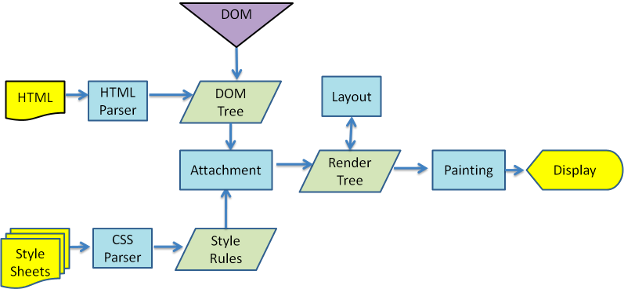

브라우저가 작동될때에는 렌더링 과정에서 `Repaint`, `Reflow`의 과정을 거치게 된다. 말 그대로 해당 `element`를 다시 칠하고 다시 flow(?) 하는것이다. `react`를 이용하는 입장에서 렌더링 최적화를 수행할때 반드시 고려해야하는 항목이기도 하다. 이 포스팅에서는 애매하게 알고있는 두가지의 개념을 정확히 짚고 넘어가도록 하겠다.

### The rendering process of a web page 
그에 앞서 브라우저가 요소를 렌더링할때 어떤 과정을 거치게 되는지 알아보자. 
<div style="width:60%;margin-bottom: 15px; margin-left:auto; margin-right: auto;">

<div style="font-size:10px;color:#8b9196;display:flex;justify-content:center">The rendering process of Webkit engine browser</div>
</div>

간단히 요약하면,
1. `HTML`을 `parsing`해서 `DOM Tree`를 만들고, `CSS`를 `parsing`해서 스타일 구조체를 만들어내는데 이를 `CSSOM Tree`라고 한다
2. `DOM Tree`와 `CSSOM Tree` 이 둘을 이용하여 `Render Tree`를 생성한다 (실제 화면에 표현되는 `Node`들로 구성) 
3. `viewport` 내에서 각 `node`들의 정확하 위치와 크기를 계산한다 (`Layout`)
4. `layout` 계산이 완료되면 이제 요소들을 화면에 그린다 (`Paint`)


### Reflow(Layout change)
위에서 짚어보았던 렌더링 과정을 거친 뒤에 최종적으로 `web page`가 그려진다. 하지만 이것은 끝난것이 아니다. 이후 어떠한 이벤트에 따라 `element`의 크기, 위치 등 `layout`을 변경하면 그 영향을 받는 `child node`, `parent node`들을 포함하여 다시 `layout`과정을 수행한다. 이때 `render tree`와 각 `element`의 크기와 위치를 다시 연산하게 되는데 이를 `Reflow`라고 한다.  
`Reflow`의 경우 다음의 대표적인 경우에 발생한다
- `node`의 추가 또는 제거
- `element`의 위치, 크기(`margin`, `padding`, `width`, `height`...)변경 
- `font` 변경, `image` 크기 변경 
- `page initial rendering`
- `window resizing` 
- `JS`를 이용한 `DOM`의 동적 변화

### Repaint(Redraw)
`reflow`처럼 `style`을 변경하는 모든것이 `layout` 수치에 영향을 받지는 않는다. `background-color`, `visibility`, `outline` 등의 `style` 변경시에는 `layout`은 변하지 않고 `reflow`가 생략된 `repaint` 과정만 발생한다.

`reflow`와 `repaint`를 완전히 피할수는 없다. `repaint`의 경우 `dom api`를 통해 `visibility`를 변경하였을때, `child node`들까지 다 검색하기 때문에 성능이 저하될 수 있다. `reflow`의 경우 해당 요소의 `child`, `parent` 모두 `layout`을 새로 연산하기 때문에 더 심각한 성능저하를 일으키기도 한다.
`Reflow`를 피하거나 그 영향을 줄일 수 있는 몇가지 방법은 다음과 같다.
1. `inline style`을 최대한 없앤다
    `inline`상에 `style`이 주어진 경우, 페이지 전체에 걸쳐서 `reflow`가 수차례 발생하게 된다. 만일 없을경우에는 외부스타일 class 조합으로 한번만 reflow를 발생시킨다
2. `animation`이 들어간 `element`의 경우 `position: fix;` 또는 `position: absolute;`로 지정한다.
    `animation`의 경우 초단위로 상당한 `reflow`를 불러일으킨다. 이 경우에 위 두가지 속성을 사용하여 다른 요소들에 영향을 끼치지 않도록 하면, 해당 요소만의 repaint만을 유발하므로 효율적이다
3. `JS`를 통해 `style`변화를 줄 경우 가급적 한번에 처리한다
```javascript
// (X)
var newElement = document.getElementById('elem');
newElement.style.background = 'blue';
newElement.style.color = '#fff';
newElement.style.border = '1px solid #ccc';
// 아래처럼 바꾼다 
// (O)
/* CSS */
// #elem1 { border:1px solid #000; color:#000; background:#ddd; }
// .coloring { border-color:#00f; color:#fff; background:blue; }
/* js */
document.getElementById('elem1').className = 'coloring';
```
4. `table` 레이아웃을 줄인다
    `table`로 구성된 요소의 경우 점진적 페이지 렌더링이 적용되지 않으며, 모두 load 되고 `연산된` 후에 화면에 보여진다. 또한 아주 작은 변화마저도 `table` 전체 모든 `node`에 대한 `reflow`를 유발한다고 한다

`reflow`와 `repaint`를 고려해서 개발을 진행하는 것도 중요하지만, 너무 성능/효율성에 치우칠 경우 퀄리티에 문제가 생길 수 있다. 적절히 `trade-off`를 생각하면서 개발을 진행하면 보기에도 훌륭하고 성능적으로도 우수한 멋진 웹페이지가 탄생할 것이다.

<br/>
<div style="font-size:10px;color:#8b9196">
<b>내용 및 이미지 출처</b><br/>
- https://medium.com/@gneutzling/the-rendering-process-of-a-web-page-78e05a6749dc
</div>
