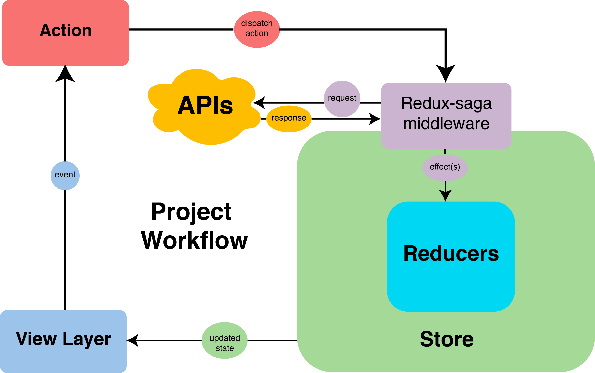

`React`를 사용하다보면 자연스럽게 상태관리 라이브러리를 고려하게 되고 이미 다양한 상태관리 라이브러리들이 존재하는것을 깨닫게 된다. 대부분의 개발자들은 가장 보편적인 `redux`를 사용할 것이며, 이 `redux`를
좀 더 편리하게 사용할 수 있도록 해주는 부가적인 라이브러리/프레임워크를 도입해서 사용하게 된다.  
그 중 이 포스트에서는 `redux-saga`에 대해 알아보려고 한다.

### Why Redux ?
`Redux-saga`를 사용하기에 앞서 `Redux`를 왜 사용하는지에 대해서 먼저 생각해보자.  
원래 `React`를 쓰면서 `state`를 사용하는데 부담을 느끼거나, `props drilling`이 대두되면서 전역적으로 효율적인 `state management`가 필요해졌고, 그에 대한 해결책으로 `Redux`가 등장했다. `Redux`를 많은 개발자들이 사용하게 되면서 그만큼 단점도 대두되게 되었는데, 환경설정이 복잡하다던가, `boilerplate`가 너무 많이 요구되고, 비동기 작업에 대한 디테일하고 편한 컨트롤이 어렵다는 문제점들 이었다. 이러한 문제점을 조금이나마 해결해줄 `Redux`와 함께 사용할수 있는 `middleware`가 등장하게 되었고, 그중 하나가 `Redux-saga`이다. 

### What is Redux-saga?

Diagram of React application with Redux-saga

`Redux-saga`는 애플리케이션의 `side effect` (`data fetching`과 같은 비동기작업 또는 `browser cache access`와 같은 순수하지 않은 작업)를 쉽게 관리하고, 
실행하기 쉽도록 하고, 테스트하기 쉬우며, 오류를 더 잘 처리하는 것을 `goal`로 하는 라이브러리이다. 
`redux`의 `middleware`중 하나인 `redux-saga`는 정상적인 `redux` 작업으로 메인 애플리케이션에서 시작, 일시중지, 취소 등을 수행할 수 있고, 전체 `redux` 상태에 접근할 수 있으며, `redux` 작업도 `dispatch`할 수 있다.  
ES6의 `generator`기능을 활용하여 이러한 비동기 동작을 쉽게 작성하고, 읽고, 테스트할 수 있다. 대부분의 비동기 `middleware`로 `redux-thunk`를 많이 사용하지만, `redux-saga`는 다양한 경우는 handling 할 수 있다

### What does Redux-saga consist of?

Generator

`redux-saga`에서는 `generator` 문법을 사용한다. 그리고 `redux-saga`에서 말하는 `saga`는 이 `generator function`이다. `saga`는 `yield`값을 `return` 하고, `middleware`가 이 값을 받아서 실행하는 역할을 한다. `saga`는 단순히 반환만 하기 때문에 테스트와 로직이 훨씬 용이하고 간편해진다.

Effect

실행할 명령을 담고 있는 `javascript` 객체

Task

하나의 `saga`가 실행되는 것

### Pros and cons
- Good 기존 요청을 취소 하거나 불필요한 중복 요청을 방지할 수 있다
- Good 특정 `action`에 다른 `action`을 연결해 요청하거나, `api` 요청 등 `redux`와 관계없는 코드를 실행할 때 효과적이다
- Good 비동기 작업을 처리하는데 편리하다 
- Good 컴포넌트 밖에서 어떠한 작업을 수행할때 편리하다
- Not Good 많이 다루지 않는 generator 문법을 사용하여 러닝커브가 존재
- Not Good typescript 지원이 미흡 
- Not Good 최근 release date가 2019년으로 오래전 

### Saga-effects
- `delay` 설정된 시간이후에 `resolve` 하는 `promise`를 리턴한다
- `put` 특정한 `action`을 `dispatch` 한다
- `call` 주어진 함수를 실행한다 (주로 api 호출에 사용)
- `take` 들어오는 `action`을 처리한다. 한번 실행되고 `event`가 삭제된다
- `takeEvery` 들어오는 모든 `action` `request`에 대해 `task`를 실행한다 (`request`시 이미 이전 `task`가 실행중이라면 이전 `task`는 자동으로 취소된다)
- `fork` 백그라운드에서 `task`를 실행한다
- `cancel` `fork`된 `task`를 취소시킨다 
- `all` `generator`함수를 배열 형태로 넣어주면 병렬적으로 해당 함수들이 동시 실행되고 전부 `resolve`될때까지 기다린다

### Review
실제 `Redux-saga`를 업무에서 몇년째 사용하고 있다. 위쪽에서 언급했던 다양한 `effects`의 다용과, 비동기 작업을 처리하는데 편리하다 등의 장점들은 확실히 다른 `middleware`보다 `redux-saga`의 매력을 높여주는 요소들이다. 하지만 실제 사용하면서 가장 크게 다가왔던 단점 중 하나가 바로 유지보수가 현재까지 제대로 이루어지지 않고 있고, 특히나 `typescript`를 프로젝트에 세팅하고 사용하는 지금 서비스에서 `redux-saga`가 `typescript`를 제대로 지원해주지 않는다는 것이 큰 기술부채가 되고 있다. (다른 상태관리 라이브러리도 검토중이다) 앞으로 `redux-saga`의 미래와 존재여부가 어떻게 될지는 잘 모르겠지만, 충분히 사용할 만하고 초기 `generator` 관련된 문법들만 잘 익힌다면 그후 사용하는데 아주 편리한 `middleware`이라고 생각한다.  
개인적으로는 빨리 유지보수와 `typescript` 지원을 발표해줬으면 좋겠다라는 바람이 있다 😆

 

<b>내용 및 이미지 출처</b> 
- https://redux-saga.js.org 
- https://itnext.io/scalable-redux-architecture-for-react-projects-with-redux-saga-and-typescript-f6afe1dece9b

