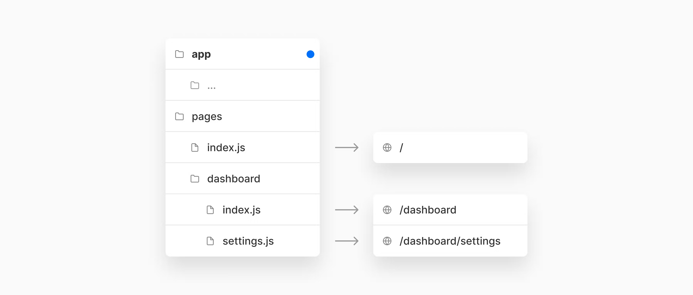

얼마전 release 된 nextjs 13version feature들을 알아보자. 자세한 내용은 <a href='https://nextjs.org/blog/next-13'>공식문서</a>에서 확인할 수 있다.

## app/ Directory (beta)
`app/` 디렉토리를 도입하여 nextjs의 `routing`, `layout` 경험을 개선하였다.

  

`app/` 이하 디렉토리는 `layout` 기능을 제공하는데, 여러 페이지간 공통적인 컴포넌트를 공유해 렌더링을 최적화 시키고 컴포넌트간 상호작용을 구현할 수 있다. 
