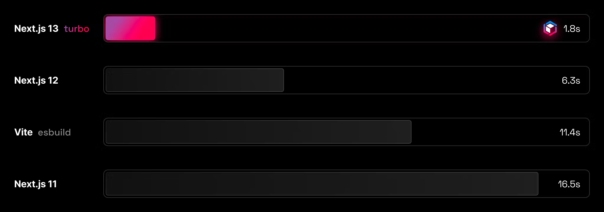
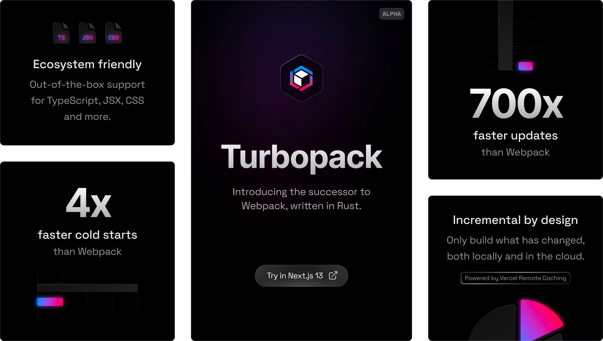

얼마전 release 된 `nextjs 13 version` feature들을 알아보자. 자세한 내용은 <a href='https://nextjs.org/blog/next-13'>공식문서</a>에서 확인할 수 있다.

## app/ 디렉토리 (beta)
`app/` 디렉토리를 도입하여 nextjs의 `routing`, `layout` 경험을 개선하였다.
<div style="width: 60%;margin-bottom: 15px; margin-left:auto; margin-right: auto;">
  
</div>

`app/` 이하 디렉토리는 `layout` 기능을 제공하는데, 여러 페이지간 공통적인 컴포넌트를 공유해 렌더링을 최적화 시키고 컴포넌트간 상호작용을 구현할 수 있다.  `app/` 디렉토리에서 routing을 하려면 `page.js`라는 파일이 필요하다.


```jsx
// before
// pages/index.js
// index route (/)
export default function Page() {
    return <h1>Next.js 13 version release!</h1>;
}

// after (`nextjs 13`)
// app/page.js
// index route (/)
export default function Page() {
    return <h1>Next.js 13 version release!</h1>;
}
```

그런 다음 파일구조를 통해 `layout`을 정의할 수 있다. 

```jsx
export default function RootLayout({ children }) {
  return (
    <html>
      <head>
        <title>Title of nextjs root layout</title>
      </head>
      <body>
        <h2>This is the shared title component</h2>
        {children}
      </body>
    </html>
  );
}
```
이렇게 설정해두면 `app/` 이하의 모든 `route`에 `RootLayout`이 노출된다

## React server component
이전 버전에서는 `server side`에서 데이터를 fetching 할때, `getServerSideProps`나 `getStaticProps`를 사용했지만, nextjs 13부터는 이 문법들을 사용하지 않는다. data fetch 함수를 선언한 뒤에 `use()` 안에 넣어주기만 하면 된다.
```jsx
import { use } from 'react';

export default function Page() {
    const data = use(getData());
    return <div>{ data }</div>
}

export async function getData() {
    const res = await fetch(`https://dummyapi.com`, {
        cache: 'force-cache' // similar to getStaticProps
        // cache: 'no-store' // similar to getServerSideProps
    });
    return await res.json();
}
```

## TurboPack
<div style="width: 80%;margin-bottom: 15px; margin-left:auto; margin-right: auto;">
  
</div>

`webpack`의 후속제품인 `Turbopack`이 발표되었다. Turbopack은 가능한 가장 빠른 개발 경험을 위해 새로운 증분 아키텍처를 기반으로 구축되었다고 한다. 
대규모 애플리케이션에서는 `Vite`보다 10배, `Webpack`보다 700배 빠른 업데이트를 보여준다. 더 큰 응용 프로그램에서는 차이가 더 크며 `Vite`보다 20배 빠른 경우도 있다. 3,000개의 모듈이 있는 응용 프로그램에서 `Turbopack`은 부팅하는 데 1.8초가 걸리는 반면 `Vite`는 11.4초가 걸린다고 한다.  
자세한 내용은 <a href='https://turbo.build/pack/docs'>turbopack 공식 홈페이지</a>에서 확인해볼 수 있다.

<div style="width: 80%;margin-bottom: 15px; margin-left:auto; margin-right: auto;">
  
</div>

## next/link 개선
이제 `next/link` 사용시 `<a>` 태그를 포함할 필요가 없다 

## @next/font (beta)
`@next/font`를 설치해서 사용하면 브라우저에서 바로 google font를 사용할 수 있다. CSS 및 font 파일은 build시 다운로드 되며 나머지 static asset과 함께 호스팅된다. 브라우저에서 google로 요청을 보내지 않는것이다. 또한 default 값으로 css size-adjust 속성을 사용하여 <a href='https://web.dev/cls/'>layout shift</a>를 방지해준다. 
