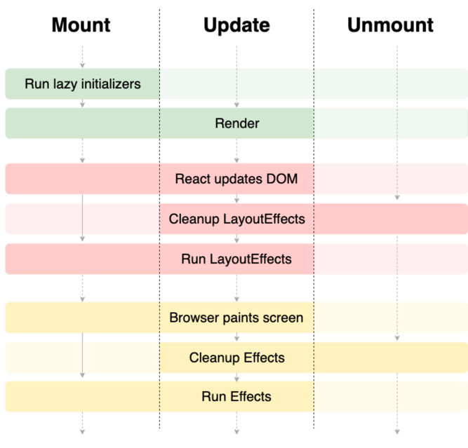

`React`로 개발을 하다보면 항상 맞닥뜨리는 문제가 하나있다. 바로 `rendering`에 관한것이다.  
특히 불필요한 `rendering`을 줄이는것은 react 개발자가 평생 가져가야할 과제일 것이다. 본격적으로 `rendering` 최적화에 대해 이야기하기 전에 `rendering`에 대해 간단히 알아보도록 하자.  

### Rendering in REACT
`React`에서 말하는 `rendering`은 `props`와 `state`의 상태를 기반으로 `component`를 구성하는 작업을 말한다. `Rendering`이 이루어지는 과정은 다음과 같다.  
 
<b>`Mount`가 이루어지는 과정</b>
1. `function component` 호출
2. 구현부분 실행  
   `Props` 확인, `hook` 실행, `variables` 및 `function` 생성  
   `hook`에 등록해둔 상태값, `effect` 등은 별도 메모리에 저장되어 관리
3. `return` 실행 (`rendering` 시작)
4. `render` 실행 (가장 `DOM` 생성)
5. `commit` 단계 (실제 `DOM`에 반영)
6. `useLayoutEffect`  
   브라우저가 `paint` 하기전에 `useLayoutEffect`에 등록해둔 `effect`가 <u>동기</u>로 실행  
   이때 `state`, `store` 등의 변경이 있다면 `re-rendering` 된다
7. `Paint`
8. `useEffect`  
   `mount`되어 화면이 그려진 직후, `useEffect`에 등록해둔 `effect`가 <u>비동기</u>로 실행

### Rerendering in REACT
1. `function component` 재호출
2. 구현부 실행
3. `return` 실행
4. `render` 실행  
   새로운 가상 `DOM` 생성 후 이전과 비교하여 달라진 부분을 탐색하고, 실제 변경을 반영할 부분을 결정한다
5. `commit` 단계에서 달라진 부분만 실제 `DOM`에 반영한다 
6. `useLayoutEffect`  
   `useLayoutEffect`에 등록된 `effect`가 <u>동기</u>로 실행  
   이때, `state`, `redux-store` 등의 변경이 있다면 한번 더 re-rendering 된다
7. `Paint`
8. `useEffect`  
   `update`되어 화면이 그려진 직후, `useEffect`에 등록해둔 `effect`가 <u>비동기</u>로 실행

### useEffect & useLayoutEffect

  

`useEffect`에 등록된 `effect`는 화면이 그려진 직후 비동기로 실행된다  
`useLayoutEffect`에 등록된 `effect`는 `DOM` 반영 후 화면이 그려지기 직전 동기로 실행된다.

### rerendering이 일어나는 조건
- `state`가 변경 되었을 때  
   `react`에서 상태관리를 위해 사용하는 `state`가 `setState`라는 메소드를 이용해 값이 변경되었을때 이를 감지하고 `rerendering`한다
- 전달받은 `props`가 변경 되었을 때  
   부모 `component`로부터 받은 `props`가 변경되었을때 `rerendering`을 한다
- 부모 `component`가 `rendering`될 때 

 

Rendering은 react 동작에서 일반적으로 발생하고, 또 요구되는 작업이지만 때로는 이 rendering이 낭비될수 있다. component의 rendering display가 변경되지 않았고, update할 필요가 없다면 똑같은 component를 또 그려내는것은 연산, 시간 낭비이다.

### Component rendering 최적화 기법
`React`에서는 이러한 낭비를 막기위해 `rendering`을 최적화할 수 있는 몇가지 주요한 `API`를 제공해주고 있다.
1. `React.memo()`
`HOC(High-order component)`형태로 내장된 메소드이다. `props`가 변경되었는지 확인하고, 변경되지 않았을 경우 `rerendering` 되지 않도록 한다. 함수형, class형 component 둘다 wrapping해서 사용할 수 있다.
2. `React.Component.shouldComponentUpdate`
rendering 초기에 호출되는 선택적 class component life cycle 메소드 이다. `false`를 `return`하면 `rendering`을 하지 않는다. 보통 이전 `props` 및 상태가 달라졌는지 확인하고, 변화가 없다면 `false`를 `return`한다.
3. `React.PureComponent`
위에서 언급한 props 및 상태 비교는 `shoudComponentUpdate`를 구현하는 가장 일반적인 방법이기 때문에, `PureComponent`는 해당 로직을 기본적으로 구현해준다.

### Props refer optimization
`function component`의 경우 `react`는 동일한 참조를 재사용 할 수 있도록 유용한 `hook`을 제공해준다. 객체를 만들거나 복잡한 연산을 하는 것과 같은 일반적인 데이터를 위한 `useMemo`와 `callback` 함수를 만드는데 사용할 수 있는 `useCallback`이다. 하지만 모든 함수나 객체에 대해 `useMemo`와 `useCallback`을 사용하게 될 경우 배보다 배꼽이 더 큰 성능이슈가 발생할 수 있다. 변경을 체크를 하는것 자체가 props를 비교하는 비용이 발생하기 때문이다. <a href='https://twitter.com/dan_abramov/status/1095661142477811717' target="_blank"  rel="noopener noreferrer">관련 내용을 언급한 Dan abramov의 트윗</a>

### React Forget 의 등장예고   
리액트 팀이 ReactConf 2021에서 `React Forget`이라는 실험적인 컴파일러를 시연했다. 이것은 자동으로 `memoization` 기능을 추가하도록 하는것. 흥미로운 점은 `hook`의 종속성 배열을 `memoization`할 뿐만 아니라 `JSX`요소 반환값도 `memoization`한다는 것이다. 다시 간단히 말해서 `React Forget`이 컴포넌트 트리 전체에서 불필요한 `rendering`을 효과적으로 제거할 수 있다는 것을 뜻한다.  
현재 `React Forget`은 출시되지 않았지만, 작업이 잘 진행되고 있다는 힌트는 존재한다. `useEvent`가 close 되었고, 다른 곳에서 'auto memoization 으로 인해 `rendering` 문제가 사라지면 어떨까요?' 라고 언급하기도 했다.

 

결국, 개발자들이 다양한 툴과 동작의 <i>trade-off</i>를 명확하게 이해해서 자신의 상황에 가장 적합한것이 무엇인지 결정하고, 이에 기반해서 기술스택이나 서비스를 만들어나가는 것이 중요한것이 아닐까.

 

<b>내용 및 이미지 출처</b> 
- https://github.com/donavon/hook-flow 
- https://blog.isquaredsoftware.com/2020/05/blogged-answers-a-mostly-complete-guide-to-react-rendering-behavior/ 

