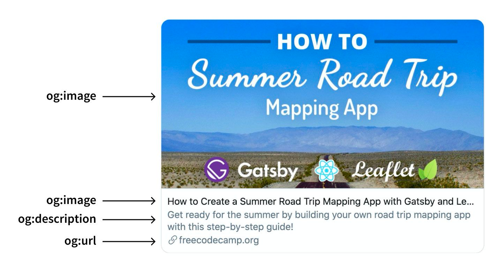

`Open graph`란 소셜 네트워크에서 시작한 개념이며 인터넷 프로토콜의 한 종류로써 2010년에 페이스북에서 발표했다. 
`open graph`의 목적은 웹페이지의 정보를 가지고 있는 meta data를 표준화 하여, 페이스북 내에서 링크를 공유할 시에 그 웹페이지가 가지고 있는 정보를 특정 형식을 통해 미리보기 형태로 제공해주는 기능이다. 특정정보를 웹페이지에서 미리 간략하게 정리하여 입력해두면 일관된 정보를 전달할 수 있다는 장점이 있다. 이후 트위터와 링크드인에서 이를 활용하여 더 나은 UX를 제공하는데에 활용되고 있다.  

<div class="quote" style="font-style: italic;font-size: 12.5px;">
The Open Graph protocol enables any web page to become a rich object in a social graph. For instance, this is used on Facebook to allow any web page to have the same functionality as any other object on Facebook.<br/><br/>
While many technologies and schemas exist and could be combined, there isn't a single technology which provides enough information to richly represent any web page within the social graph. The Open Graph protocol builds on these existing technologies and gives developers one thing to implement. Developer simplicity is a key goal of the Open Graph protocol which has informed many of the technical design decisions.
</div>
 

### How to use
`metadata`를 `<head>` 영역에 추가하면 bot이 해당 `metadata`를 읽어서 내용을 표시해준다. 다음은 주로 쓰이고 되도록 명시하기를 권장하는 속성들이다.
- `og:title` 표시될 제목
- `og:type` website의 유형 (<a href='https://ogp.me/#types'>참조</a>)
- `og:image` 표시할 `image`의 주소
- `og:url` 전달할 website 주소  
- `og:description` website에 대한 설명
- `og:site_name` website의 이름
- `og:locale` location 정보 

<br/>
실제 코드는 아래와 같이 입력한다.

```html
<html lang="en">
<head>
       <title>The Rock (1996)</title>
       <meta property="og:title" content="The Rock" />
       <meta property="og:type" content="video.movie" />
       <meta property="og:url" content="https://www.imdb.com/title/tt0117500/" />
       <meta property="og:image" content="https://ia.media-imdb.com/images/rock.jpg" />
       ...
</head>
...
</html>
```

<div style="width: 80%;margin-bottom: 15px; margin-left:auto; margin-right: auto;">
  
<div style="font-size:12px;color:#8b9196;display:flex;justify-content:center">Example of Twitter card using Open Graph tags</div>
</div>

### Tag type
`opengraph`의 경우 몇개 대표적인 플랫폼들의 meta tag를 사용할 수 있도록 하고있다.

```html
<!-- 일반 -->
<meta property="og:title" content="...">
<meta property="og:url" content="...">
<meta property="og:type" content="...">
<meta property="og:image" content="..."> 
<meta property="og:site_name" content="..."> 
<meta property="og:description" content="...">

<!-- twitter -->
<meta name="twitter:card" content="...">  
<meta name="twitter:title" content="...">  
<meta name="twitter:description" content="...">  
<meta name="twitter:image" content="...">  

<!-- mobile -->
<meta property="al:ios:url" content="...">  
<meta property="al:ios:app_store_id" content="...">  
<meta property="al:ios:app_name" content="..."> 
<meta property="al:android:url" content="...">  
<meta property="al:android:app_name" content="...">  
<meta property="al:android:package" content="...">  
```

### Optimal size of Opengraph image ?
`opengraph`에는 thumbnail image를 넣을 수 있다. 하지만 플랫폼마다 지원하는 image size가 다른데 고정값을 넣어주어야 하기때문에 몇가지 유의 사항들을 고려하면 좋다.
- `facebook`에서 권장하는 크기는 `1200`x`630` 픽셀이며, 그 image 파일용량은 `5MB`를 넘지않도록 권장한다  
- `600` 픽셀 미만의 image는 `opengraph` 제목 왼쪽에 표시된다
- 최소 크기는 `200`x`200` 이나 해상도가 이정도로 낮은 것은 권장하지 않는다

### Caution
기존 페이지에 cache가 남아있을 수 있으므로 적용하는데 시간이 걸릴수 있다  
페이스북은 cache를 reload하는 기능을 제공해주기도 한다 https://developers.facebook.com/tools/debug

### Useful tools  
- opengraph 미리보기 https://www.opengraph.xyz/    
- localhost에서 확인을 도와주는 크롬 익스텐션   
<a href='https://chrome.google.com/webstore/detail/localhost-open-graph-debu/kckjjmiilgndeaohcljonedmledlnkij?hl=ko'>Localhost Open Graph Debugger</a>  
    <a href='https://chrome.google.com/webstore/detail/localhost-open-graph-chec/gcbnmkhkglonipggglncobhklaegphgn?hl=ko'>Localhost Open Graph Checker</a>


<br/><br/>
<div style="font-size:10px;color:#8b9196;word-break: break-all"><b>내용 및 이미지 출처</b><br/>
- https://ogp.me/<br/>
- https://iamturns.com/open-graph-image-size<br/>
- https://developers.facebook.com/tools/debug/
</div>

