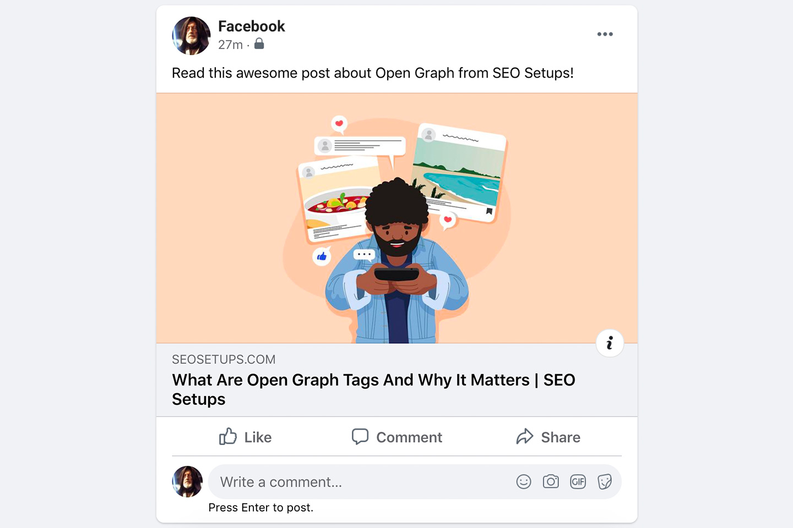

`Open graph`란 소셜 네트워크에서 시작한 개념이며 인터넷 프로토콜의 한 종류로써 2010년에 페이스북에서 발표했다. 
`open graph`의 목적은 웹페이지의 정보를 가지고 있는 meta data를 표준화 하여, 페이스북 내에서 링크를 공유할 시에 그 웹페이지가 가지고 있는 정보를 특정 형식을 통해 미리보기 형태로 제공해주는 기능이다. 특정정보를 웹페이지에서 미리 간략하게 정리하여 입력해두면 일관된 정보를 전달할 수 있다는 장점이 있다. 이후 트위터와 링크드인에서 이를 활용하여 더 나은 UX를 제공하는데에 활용되고 있다.  
 

  

 

<b>내용 및 이미지 출처</b> 
- https://ogp.me/ 

