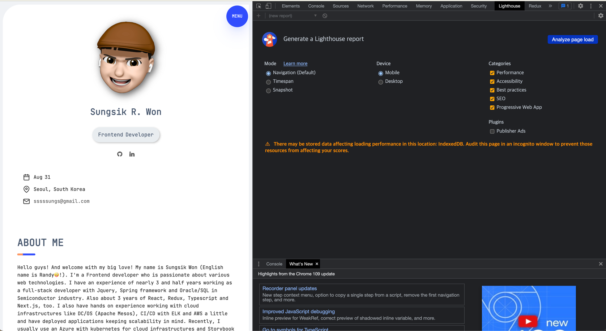

### What is the Lighthouse?
`lighthouse`는 `chrome` 내 개발자도구에 내장된 웹앱의 품질개선에 도움을 주는 자동화 `performance` 측정 도구이다. 구글이 직접 운영하는 open source project이다. 
`chrome extension` 설치 후 `F12`로 개발자 도구를 열어 `lighthouse` 탭에서 `Analyze page load`를 선택하면 현재 페이지가 자동으로 reload 되며 검사가 진행되고 `lighthouse report`를 생성해준다.

 

  

wip
