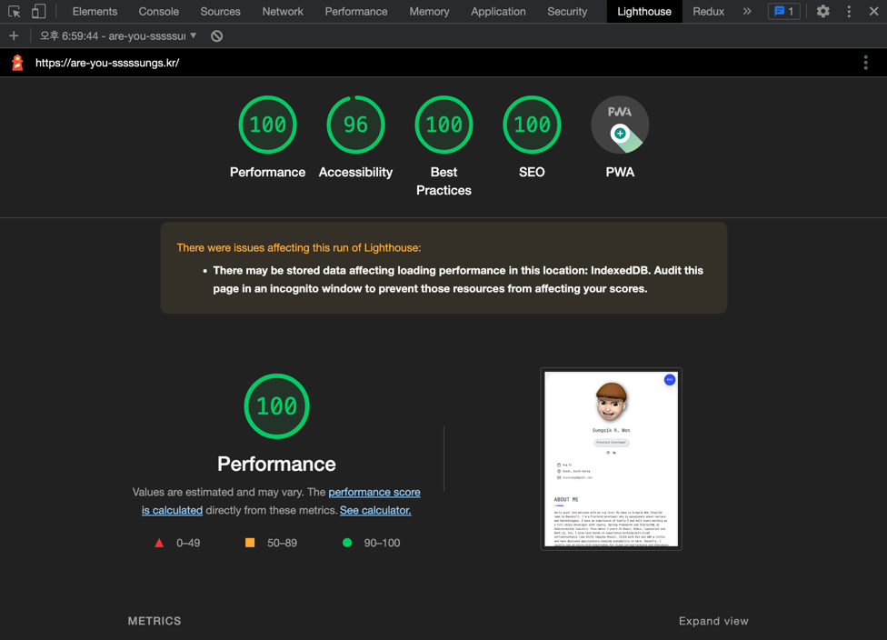

### What is the Lighthouse?
`lighthouse`는 `chrome` 내 개발자도구에 내장된 웹앱의 품질개선에 도움을 주는 자동화 `performance` 측정 도구이다. 구글이 직접 운영하는 open source project이다. 
`chrome extension` 설치 후 `F12`로 개발자 도구를 열어 `lighthouse` 탭에서 `Analyze page load`를 선택하면 현재 페이지가 자동으로 reload 되며 검사가 진행되고 `lighthouse report`를 생성해준다.

 

  

 

  

 

`lighthouse`report에는 <i>`Performance`(성능), `Accessibility`(웹접근성), `Best practices`(웹표준), `SEO`(검색엔진최적화), `PWA`(Progressive Web app, 모바일화)</i> 다섯개 항목을 점수화 해서 보여준다. 이번 포스트에서는 `Performance` 측정시 어떤 기준을 가지고 평가하는지 구체적으로 알아보도록 하자.

### Performance metrics of Lighthouse
`lighthouse`는 성능측정을 위해서 다음과 같은 `metric`들을 사용한다(`metric`은 다음 버전에서 새로 생기거나 때로는 사라지기도 한다). 그럼 하나하나씩 알아보도록 하자.
1. First Contentful Paint   
2. Largest Contentful Paint
3. Speed Index
4. Total Blocking Time  
5. Time to Interactive
6. Cumulative Layout Shift

 

First Contentful Paint

 ✔︎ 성능 지표를 추적하는 metric  
 ✔︎ 사용자가 웹페이지에 접속했을때 첫번째 `DOM Content`를 `rendering` 하는데 걸리는 시간을 측정한다. 이는 곧 사용자가 느끼는 페이지 로딩속도로 판단할 수 있고, `FCP`가 1.8초 이하의 경우 <u>우수한 사용자 경험</u>을 제공한다고 할 수 있다.  
 ✔︎ 해당 페이지의 `image`, `canvas`요소, `svg` 등 모두 `DOM Content`로 구분되며, `iframe`의 경우는 포함되지 않는다.
  
  

Largest Contentful Paint

✔︎ `viewport`를 차지하는 가장 큰 `content`(`image`, 텍스트블록)의 `rendering` 시간을 측정한다.  

(wip)
