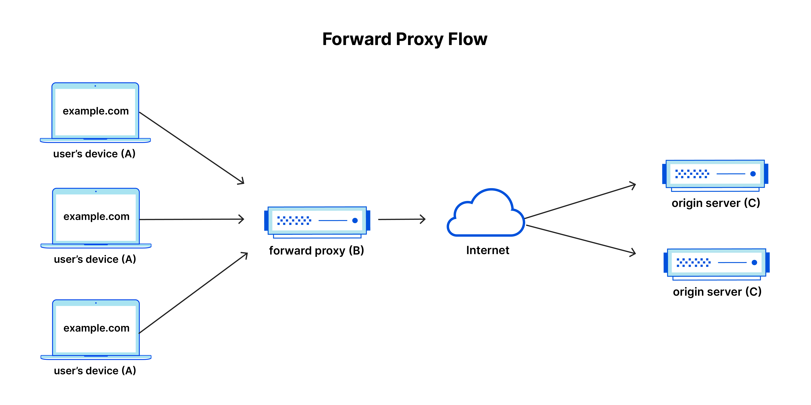

 `Proxy`의 사전적 의미는 <i>대신</i>,<i>대리</i>라는 의미이다. 말 그대로 두개의 end-point에서 통신을 할때 중간에서 대리로 통신을 해주는것을 `proxy`라고 하고, 이 역할을 하는 서버를 `proxy server`라고 부른다. 
 웹 환경에서 생각해본다면 `client`와 `server` 사이의 중계서버 정도로 생각할 수 있다. `proxy server`는 보안목적이나 때로는 caching의 기능을 제공한다.

 

  

`proxy server`의 경우 그 위치에 따라 두가지 종류로 크게 나눌 수 있다.
- Forward proxy
- Reverse proxy

### Forward Proxy
번역하면 정방향 프록시 정도가 되겠다. end user(client)와 internet 사이에 위치하여 user들이 보낸 요청을 가로채 중개자처럼 해당 client를 대신하여 웹서버와 통신한다.

  

 

표준 인터넷 통신에서는 `A`가 `C`에 direct연결이 되어 client는 원본 서버(`C`)에 요청을 보내며 원본 서버가 client에 응답하게 된다. `forward proxy`가 설정되면 `A`가 `C`에 바로 요청을 하는것이 아니라 `B`로 요청을 보내고 `B`가 그 요청을 `C`로 전달하며, 반대의 경우 역시 `C`에서 보낸 응답을 `B`가 `A`에게 전달한다.  
그럼 `forward proxy`를 설정하는 이유는 무엇일까 
1. <i>액세스 권한을 제한</i>  
   일부 조직에서는 방화벽을 사용해서 사용자들에게 제한된 인터넷 액세스 권한을 부여한다. `forward proxy`를 통해 이를 1차적으로 제한할 수 있다. 예를 들어 학교에서 컨텐츠 필터링 규칙을 활성화 하는 프록시를 통해 웹에 연결한다면, facebook이나 기타 소셜 미디어 사이트의 응답 전달을 막을 수 있다.
2. <i>온라인에서의 privacy 보호</i>  
   `forward proxy`를 통하게 되면 인터넷에 남게되는 `IP`주소의 출처가 proxy의 `IP`주소로 고정이 되기 때문에 추적을 막을 수 있다.

 

<b>내용 및 이미지 출처</b> 
- https://www.cloudflare.com/ko-kr/learning/cdn/glossary/reverse-proxy/

