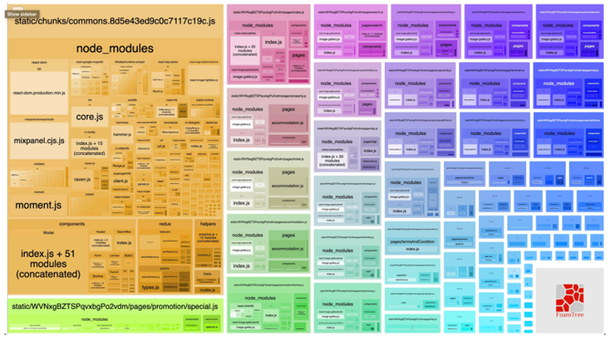
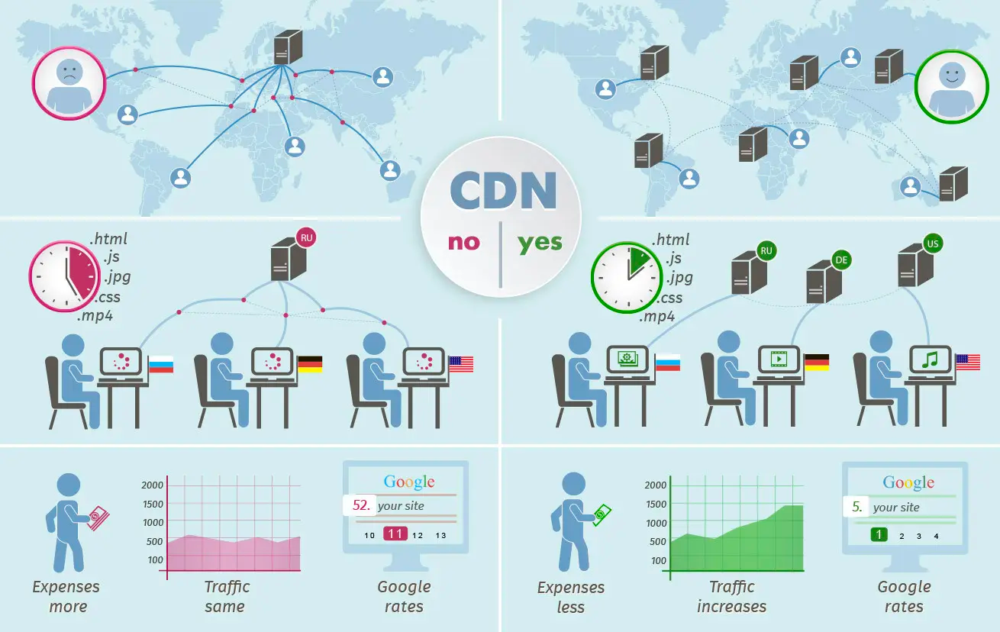

웹성능 개선을 위한 이것저것/여러가지 방법을 작성해보려고 한다. 개인적으로 공부하는 내용이라 두서가 없을 수 있으니 주의!

### Bundle analyzer
`bundle`된 `JS` 파일이 어떤 코드들로 어느정도의 크기를 가지고 있는지 가시화 하여 보여주는것이 바로 `bundle-analyzer`이다. `NEXTJS`를 사용한 경우 <a href="https://www.npmjs.com/package/@next/bundle-analyzer"  target='_blank' rel='noopener noreferer'>@next/bundle-analyzer</a>를, `CRA`(`create-react-app`)을 사용한 경우에는 <a href="https://www.npmjs.com/package/cra-bundle-analyzer"  target='_blank' rel='noopener noreferer'>cra-bundle-analyzer</a>를 세팅하면 된다. bundle analyzer를 실행하면 아래 사진처럼 JS 코드가 어떻게 구성되어 있는지 보여준다. 그 크기가 클수록 큰 용량을 차지한다. 

<div style="width: 60%;margin-bottom: 15px; margin-left:auto; margin-right: auto; box-shadow: 1px 1px 5px grey">
  
</div>


### Image size optimization with CDN
<div style="width: 60%;margin-bottom: 15px; margin-left:auto; margin-right: auto; box-shadow: 1px 1px 5px grey">
  
</div>
<br/>

image `CDN`을 사용한다. `CDN`(`Content Delivery Network`)은 컨텐츠를 빠르고, 저렴하고, 안전하게 전송하기 위해 연결된 서버 네트워크이다. 지리적으로 분산시켜 웹 컨텐츠를 사용자와 가까운 곳에서 전송함으로써 전송 속도를 높인다.  
`CDN`은 image 뿐만 아니라 `web page`, `image`, `video` 등의 컨텐츠를 사용자의 물리적 위치와 가까운 server에 `caching`한다. 대표적인 image `CDN` service는 <a href="https://cloudinary.com/" target='_blank' rel='noopener noreferer'>cloudinary</a>, <a href="https://imagekit.io/"  target='_blank' rel='noopener noreferer'>imagekit.io</a> 등이 있다.


### Code splitting & Lazy loading  
`bundler`를 사용하면 하나의 bundle로 코드를 변환해주어 앱을 로드할때 편리하지만, 별도의 큰 third-party library를 포함하는 경우 이 또한 bundle에 포함되기 때문에 로드시간이 오래 걸리는 문제가 발생한다. 이때 `code splitting`과 `lazy loading`을 사용하면 성능을 향상 시킬 수 있다.  
`lazy component`는 `Suspense` 하위에서 rendering되어야 하며, `suspense`는 `lazy component`가 로드되길 기다리는 동안 로딩화면을 보여줄 수 있다.

```typescript
import React, { Suspense } from 'react';
const OtherComponent = React.lazy(() => import('./OtherComponent'));

function MyComponent() {
    return (
        <div>
            <Suspense fallback={<div>Loading...</div>}>
                <OtherComponent />
            </Suspense>
        </div>
    );
}
```

### Don't use the INDEX as KEY

`key`는 `React`가 어떤 항목을 변경, 추가 또는 삭제할지 식별하는 것을 돕는다. 안정적인 고유성을 부여하기 위해 내부의 `element`에 명시하게한다. 대부분의 경우 반복문을 사용하는 `data set`의 `unique`한 `id`를 `key`로 사용한다.  
```typescript
todos.map((todo, index) => (
    <Todo {...todo} key={index} /> // don't
  ));
}
```
만약 항목의 순서가 바뀔 수 있는 경우, `key`에 `index`를 사용하는것은 권장하지 않는다. 성능이 저하되거나 `component`의 `state`와 관련된 문제가 발생 할 수 있기 때문이다. 이 <a href='https://robinpokorny.medium.com/index-as-a-key-is-an-anti-pattern-e0349aece318' target='_blank' rel='noopener noreferer'>포스팅</a>에서 자세히 설명되어 있다. `component`는 `key`를 보고 갱신되고 재사용된다. `index`를 사용했다면 항목의 순서가 바뀌었을 경우 `key`또한 바뀌었을 거고 이는 `state`에 영향을 줄 수 있다. 하지만 배열의 항목들이 `static`하여 변경되지 않는 단순 반복의 경우에는 `index`를 `key`로 사용해도 문제가 발생할 확률이 낮다. 

### Animation optimization 
`will-change` 속성은 요소에 예상되는 변화의 종류에 관한 힌트를 브라우저에 제공한다.  그래서 요소가 변화되기 전에 미리 브라우저는 적절하게 최적화할 수 있다.  
<br/>
`animation`을 구현할때 javascript code를 이용할 수도 있지만 `css`를 이용해서도 훌륭한 `animation`을 구현할 수 있다. 하지만 animation 처럼 움직임이 발생하는 경우 그에 따른 연산동작도 꽤나 많은 부하가 필요하고 적절히 효율적인 코드로 작성하는것이 반드시 필요하다.    
일반적으로 `animation`을 구현하게 되면 다음과 같은 흐름으로 동작하게 된다.
1. _Recalculate_ (`element`에 `style`이 적용될 경우 발생)
2. _Reflow_ (적용된 `style`에 의해 위치나 크기가 변경되어 계산이 필요한 경우 발생 : <b>CPU</b>를 이용하여 수행)
3. _Repaint_ (`element`가 화면에 다시 그려져야 할 경우 발생)  

하지만 <b>GPU</b>를 사용하는 option을 사용할 경우에는 다음과 같은 흐름으로 동작한다.

1. _Recalculate_
2. _Composite_ layer (Render layer를 계산하고 합성 : GPU를 이용하여 수행)

<b>GPU</b>를 통해 `animation`을 수행한다는 것은 기하구조를 계산하고 그려주는 `reflow`/`repaint` 동작을 **CPU**에서 거칠 필요가 없다는 뜻이다. 대표적으로 **GPU**를 사용하는 css option은 `transform`과 `opacity`가 있다. 효율적인 `animation`을 구현하기 위해 이 `top`/`left`, `display`를 사용하기보다 이 두가지를 적극적으로 활용하도록 하자. 

<br/>
<div style="font-size:10px;color:#8b9196;word-break: break-all"><b>내용 및 이미지 출처</b><br/>
- https://robinpokorny.medium.com/index-as-a-key-is-an-anti-pattern-e0349aece318<br/>
- https://developer.mozilla.org/en-US/docs/Web/Performance/CSS_JavaScript_animation_performance#running_the_performance_test<br/>  
- https://www.smashingmagazine.com/2016/12/gpu-animation-doing-it-right/
</div>


