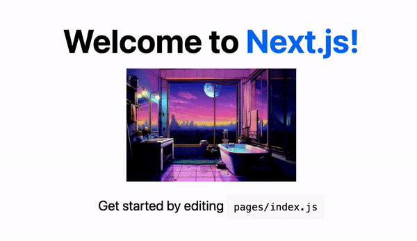

`Nextjs`를 사용해서 코딩을 할때 ``를 사용하면 다음과 같은 `warning`이 뜨는것을 볼 수 있다.

<div class="quote">
Error: Do not use img. Use Image from 'next/image' instead. See https://nextjs.org/docs/messages/no-img-element.  @next/next/no-img-element
</div>

그럼 사용해줘야하지 않겠는가? 이번 포스팅에서는 다양한 기능과 사용자 경험을 향상시킬 수 있는 `next/image` 컴포넌트에 대해서 알아보려고 한다.  

`Nextjs`에서 제공하는 `Image component`는 _**version 10**_ 부터 등장했으며 그 기능을 요약하자면 다음과 같다. 
- 최신 `image format`으로 여러 `device`를 대응하여 적절한 `image size` 제공
- `layout shift` 방지 
- `image`가 `viewport`에 들어갈때만 `load` 되도록하며 `placeholder`를 제공
- `image`를 `webp`와 같은 용량이 작은 포맷으로 변환제공 


### How to use
`next/image`의 사용법은 아래와 같다
```javascript
import Image from 'next/image';
const Photo = () => {
  return (
      <Image
          src={'https://imageurl.com'}
          alt="photo-of-you"
      />
  )
}
```

`next/image`는 정적이미지의 경우 `width`, `height`, `blurDataURL`이 자동으로 생성된다. 원격저장소에 저장되어 있는 이미지를 사용할 경우 `width`, `height`를 필수적으로 입력해주어야 한다. 정적이미지의 경우 `build`시 `width`, `height`를 계산할 수 있으나 그렇지 않는 경우는 불가능하기 때문이다.

### Props
_Required props_  

➣ src  
ㅤ• 정적 이미지 위치 입력  
ㅤ• 외부 url (보안을 위해 `next.config.js`에 `domain` 설정 필요)
   <br/>

➣ width & height  
ㅤ• `layout`이 `fill` 또는 정적이미지가 아닌 경우를 제외하고는 모두 필수로 명시해주어야 한다
   <br/>

➣ alt  
ㅤ• 웹 접근성(screen reader)을 위해서 명시 필요

_Optional props_  

➣ loader  
ㅤ• `src`, `width`, `quality` 등의 parameter를 활용해서 image URL을 받아오도록 _customize_ 할수 있다  

```javascript
const imageLoader = ({ src, width, quality }) => {
  return `https://example.com/${src}?w=${width}&q=${quality || 75}`
}
 
export default function Page() {
  return (
    <Image
      loader={imageLoader}
      src="me.png"
      alt="Picture of the author"
      width={500}
      height={500}
    />
  )
}
```

➣ placeholder  
ㅤ• `image`가 로딩되기 전에 페이지에서 그만큼의 자리를 어떻게 `display`할지에 관한 속성이다.  
ㅤ• `blur`, `empty`로 지정할 수 있으며, `blur`로 지정하면 `image`가 로드되기 전에 `blur`처리한 화면이 보이고, 완전히 로드되면 `image`가 나타난다. 정적이미지의 경우 자동으로 `blurDataURL`(블러이미지)을 생성해 준다.

<div class='cypress-gif'>


<div class='caption2'>정적이미지는 blur image를 자동 생성</div>
</div>


<br/><br/>

➣ priority  
ㅤ• `image`를 미리 렌더링 되도록 하는 옵션이다. 가장 처음 노출되는 `image`에는 이 속성을 `true`로 설정하여 미리 렌더링 하는것이 유리하다. (`lazy loading`이 비활성화 되므로 `LCP` 요소로 측정된 `image`에는 사용해주는것이 `web vital score`에 도움이 될것이다.)  
<br/><br/>

➣ quailty  
ㅤ• `1`에서 `100`까지 숫자로 지정하며 `100`이 최고 품질이다. 기본값은 `75`
<br/><br/>

➣ sizes  
ㅤ• <a href='https://web.dev/cls/' target="_blank" rel="noopener noreferrer">CLS(Cummulative layout shift)</a> 현상을 방지하기 위해서는 `image size`를 `viewport`에 맞게 `load`해야한다. 이때 사용되는 옵션이고, 브라우저가 `page load`시에 `layout`에 대해 해치지 않는 선에서 `load`를 실행하게 된다.   
ㅤ✷ 참고로 `next/image`에서는 <a href='https://ahrefs.com/seo/glossary/srcset' target="_blank" rel="noopener noreferrer">srcset</a>(viewport widths에 따라 load될 image 후보들을 설정하는 CSS 속성) `attribute`를 자동으로 설정해 `load`될 `image` 후보들중 알맞은 `viewport width`의 `image`를 로드한다. 이때 `next.config.js` 내부에 설정된 `deviceSizes`(device breakpoint), `imageSizes`(image width)를 사용하게 된다.
<br/><br/>

### Cache
`default loader`의 경우 `image`가 한번 `loading` 되면 그 이후에는 `optimize`된 `image`가 `<distDir>/cache/images`에 `caching` 된다. `expiration time`은 `cache-control`로 제어된다  
(`default loader`가 아닌 `3rd party cloud`에 대한 `Image loader`를 사용할 경우에는 해당 `loader`에서 지원하는 방식을 사용해야 한다)


`next`도 많은 업데이트가 이루어 지면서 다양한 기능을 제공하고 있다. 특히 `image`를 최적화 하는것은 프론트엔드 개발자의 가장 큰 숙제가 아니었나 싶다. 다양한 `props`를 가지고 다양한 기능을 제공하는 만큼, 서비스의 운영환경에 맞게 알맞은 최적화 방법을 적절히 찾아서 적용하면 좋을것 같다.  
조만간 현업에서 랜딩페이지를 제작할 일이 있어 집중탐구 후 사용할것 이다. 그 이후 또 느낀점을 공유해보도록 하겠다.


<br/>
<div style="font-size:10px;color:#8b9196;word-break: break-all"><b>내용 및 이미지 출처</b><br/>
- https://nextjs.org/docs/pages/api-reference/components/image<br/>
- https://nextjs.org/docs/pages/building-your-application/optimizing/images<br/>
- https://web.dev/cls<br/>
- https://ahrefs.com/seo/glossary/srcset<br/>
</div>

