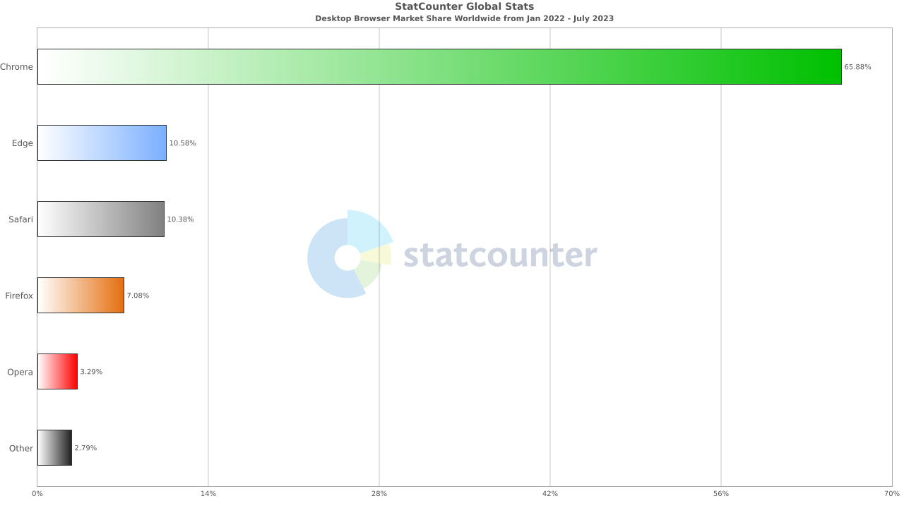

### Babel 
`webpack`을 이용해 프로젝트를 세팅하다보면 항상 `babel`을 함께 사용하게 된다. `babel`은 `javascript compiler`라고 공식사이트에서 소개하고 있으며, 그렇다면 왜 이것이 필요할까?  
`frontend` 기술 패러다임은 빠르게 발전하고 있다. 최신 `browser`에서도 지원하지 않는 새로운 문법과 기술이 등장하고 있으며 모든 사람들이 최신 `browser`를 사용하는것도 아닐 것이다. 다음 차트는 2022년 1월부터 2023년 7월 현재까지 세계적으로 사용되는 `browser`를 보여준다. 우리에게 익숙한 `chrome`, `safari`를 제외한 다른 `browser`들이 여전히 사용되고 있다. 

<div style="width: 80%;margin-bottom: 15px; margin-left:auto; margin-right: auto;">
    
    <div style="font-size:13px;color:#8b9196;display:flex;justify-content:center;margin-top:7px;">출처:&nbsp;<a href="https://gs.statcounter.com/browser-market-share/desktop/worldwide/#monthly-202201-202307-bar" target="_blank" rel='noopener noreferer'>statcounter</a></div>
</div>

또한 순수 `javascript`가 아닌 `typescript`, `coffeescript` 등 새로운 형태의 언어도 나오고 있다. 이러한 새로운 언어들을 다양한 환경에서 호환되도록 도와주는 것이 `babel`이고, 이를 `transpiler`라고도 한다.

### SWC
`SWC(Speedy Web Compiler)`는 `babel`과 동일한 역할을 수행하는 컴파일러로, `Rust`로 구현되어 있고 속도와 성능 개선에 초점을 맞추고 있으며 `single thread` 기준 `babel`보다 20배 넘는 성능을 보여준다. `Nextjs`, `parcel`, `deno` 등의 tool에 사용되고 있다.

<div class="quote">
SWC is 20x faster than Babel on a single thread and 70x faster on four cores. [출처:https://swc.rs] 
</div>

현재 일하는 프로젝트에서는 `webpack`+`babel` 조합으로 프로젝트를 진행하고 있다. 아직 시작한지 3년 남짓한 프로젝트이기 때문에 그렇게 크진않지만 점점 빌드시간이 늘어나는것이 체감되고 있는 현실이다. 얼마전까지는 테스트 환경 빌드를 할때에 20분 이상 도달했던 적도 있다.  
빌드시간을 줄일수 있는 방법중 가장 빠르게 적용해볼 수 있는 방법중 하나로 `babel`을 `swc`로 변경하는 것으로 생각했고 진행을 해보았다. 빌드를 진행할때마다 `Disabled SWC as replacement for Babel because of custom Babel configuration ".babelrc" `이라고 경고메시지가 떠서 이것을 언젠가는 없애보리라 생각했던것을 몸소 옮기게 된것이다. <span style='font-size:10px;color:grey;'>(사실 예전에도 한번 시도했던적이 있지만 그때는 현재 작성되어 있는 테스트코드를 커버하지 못해 중간에 손을 놓았었다)</span>


### Process
가장 먼저 진행한 내용은 `swcMinify`를 `true`로 설정한 것이다.   
그 다음으로는 `babel` 관련된 파일을 모두 제거했다. 하지만 꽤나 많은 내용이 `babel-dependent` 하게 셋업되어있는것을 다시한번 느꼈다. 그리고 가장 `base`가 되는 `module`인 `@swc/cli`, `@swc/core`, `@swc/helpers`, `swc-loader`를 설치하였다. 그리고 `next.config.js` 내부로 `babel` 설정을 하나씩 하나씩 옮기기 시작하였다. 기존 프로젝트에서는 `css-in-js` 패키지로 `emotion.js`를 사용하고 있었기 때문에, `@emotion/babel-plugin`을 비롯한 여러 `emotion` 관련 패키지를 삭제하고, `next.config.js` 파일에 `emotion`을 `true`로 세팅하였다. `NEXTJS` 공식문서에는 `emotion`관련된 컴파일을 위해 다양한 옵션을 제공해주고 있으니 좀더 디테일한 설정이 필요하면 <a href='https://nextjs.org/docs/architecture/nextjs-compiler#emotion' target="_blank" rel="noopener noreferrer">관련공식문서</a>를 참조하도록 하자.  

```javascript
compiler: {
    emotion: true
}
```

그리고 `lodash`에 대해서 `tree-shaking` 설정을 해주었다. 보통 `lodash`를 사용할때 전체를 `import`해서 사용하는 경우가 많은데, 기존 프로젝트에서는 용량 최적화를 위해서 필요한 `function`만 `import` 하는 방식으로 작업을 했었다.
```javascript
import _ from 'lodash'; // X
import _find from 'lodash/find'; // O
```
이렇게 `tree-shaking`에 대한 옵션인 `modularizeImports`에 `transform` 형태로 넣어주면 설정을 할 수 있다. (`preventFullImport` 옵션을 `true`로 하게되면 전체를 `import`하는 구문 (위의 예제처럼)이 있을 경우 친절하게 `compile error`를 발생시켜준다)
```javascript
experimental: {
    modularizeImports: {
        lodash: {
            transform: 'lodash/{{member}}'
            // preventFullImport: true
        }
    }
}
```

다음으로 진행했던 것은 테스트 코드 관련한 `module` 설정이었다. `babel`을 사용하면서 테스트코드의 많은 부분이 종속되어 있었고, 이것을 해결하는것이 곧 `swc`를 적용하는것과 같다고 해도 무방할 만큼 큰 `migration` 작업이었다. 많은 버그와 설정을 통해서 완전히는 아니지만 돌아가는 정도로 구현하였다. 먼저 `jest`를 사용하기 위해 `@swc/jest` 패키지를 설치하였고, `typescript`를 사용하고 있었기 때문에 `@types/jest` 또한 추가로 설치하였다. 그리고 `babel`에서 사용하던 옵션들을 하나하나 옮겨왔다.  
먼저 파일에 대한 `transform` 모듈을 `@swc/jest`로 지정해주었다. 
```javascript
transform: {
    '^.+\\.(t|j)sx?$' : ['@swc/jest']
}
```

<br/>
<div style="font-size:10px;color:#8b9196;word-break: break-all"><b>내용 및 이미지 출처</b><br/>
- https://gs.statcounter.com/browser-market-share/desktop/worldwide/#monthly-202201-202307-bar<br/>
- https://swc.rs/<br/>
- https://nextjs.org/docs/architecture/nextjs-compiler#emotion<br/>
</div>

