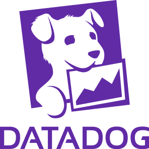

`frontend` 개발을 하다보면 여러가지 에러를 맞닥드리는 경우가 잦다. api 요청중에 발생한 에러이건, 아니면 실제 `runtime`중에 발생하는 에러이건 말이다. 그래서 이러한 에러와 문제상황을 모니터링 하기위한 많은 `solution`들이 존재한다.  
아마 대표적인 `solution`이 <a href='https://sentry.io/welcome/' target="_blank" rel="noopener noreferrer">Sentry</a>, <a href='https://www.datadoghq.com' target="_blank" rel="noopener noreferrer">Datadog</a> 등 일 것이다. 현재 내가 속한 개발팀에서는 Datadog을 사용하고 있으므로, datadog을 기준으로 내 경험을 말하도록 하겠다.
그보다 앞서, 이전직장에서의 이야기를 해보자면 이렇다. 이전 직장에서 마지막 프로젝트가 개발자들을 위한 `CICD portal`을 구축하는 프로젝트였다. 뿐만아니라 `CICD`와 연계하여 모니터링 대시보드를 제공해주는 업무까지 구축했어야했다. 그때는 `cloud` 기반이 아닌 `on-premise` 방식의 인프라를 가지고 있었고, solution을 도입하는것도 쉽지 않았다. 그래서 그 프로젝트에서는 `ELK`를 활용해서 기본적인 수집 아키텍쳐를 구성하고 실제 대시보드는 `grafana`의 `time-series` 그래프를 활용해서 구축했던 기억이 있다. (중간에 퇴사를 해서 마무리는 어떻게 되었는지 모르겠다만..)  

어쨋든 이 포스팅에서는 내가 직접 사용하고 있는 `datadog`에 대해서 이야기를 해보려고 한다.  

### Datadog
<b>`Datadog`</b>은 서버, 데이터베이스, 도구 및 서비스에 대한 모니터링을 통해 클라우드 규모 애플리케이션에 대한 전체적인 모니터링 서비스를 `Saas` 형태로 제공하는 모니터링 솔루션 중 하나이다. 마스코트는 `Bits`라는 강아지이다. (귀엽) `Datadog`은 서버상태를 실시간 모니터링하는 기능을 기본으로하여, 다양한 클라우드 플랫폼(Aws, Azure, Google cloud등)기반의 서비스와 통합기능을 제공하고 데이터베이스나 캐시스토어 등에 대한 추가적인 메트릭 수집/모니터링을 지원한다.

    

현재 프로젝트에서는 `Logging`, `RUM (Real User Monitoring)`, `Session play` 이 세가지를 주로 활용하고 있다. 물론 이들은 `frontend` 입장에서 트러블슈팅을 하기 위해서 사용하는 기능이고 실제로 개발팀을 위해 셋업되어 있는 것은 `k8s`연동이나, 실제 리소스 metric 수집 등 다양한 기능들을 사용하고 있다.

### Logging

### RUM (Real user monitoring)

 
 

<b>내용 및 이미지 출처</b> 
 

