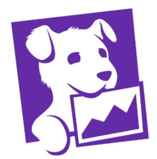

`frontend` 개발을 하다보면 여러가지 에러를 맞닥드리는 경우가 잦다. api 요청중에 발생한 에러이건, 아니면 실제 `runtime`중에 발생하는 에러이건 말이다. 그래서 이러한 에러와 문제상황을 모니터링 하기위한 많은 `solution`들이 존재한다.  
아마 대표적인 `solution`이 <a href='https://sentry.io/welcome/' target="_blank" rel="noopener noreferrer">Sentry</a>, <a href='https://www.datadoghq.com' target="_blank" rel="noopener noreferrer">Datadog</a> 등 일 것이다. 현재 내가 속한 개발팀에서는 Datadog을 사용하고 있으므로, datadog을 기준으로 내 경험을 말하도록 하겠다.
그보다 앞서, 이전직장에서의 이야기를 해보자면 이렇다. 이전 직장에서 마지막 프로젝트가 개발자들을 위한 `CICD portal`을 구축하는 프로젝트였다. 뿐만아니라 `CICD`와 연계하여 모니터링 대시보드를 제공해주는 업무까지 구축했어야했다. 그때는 `cloud` 기반이 아닌 `on-premise` 방식의 인프라를 가지고 있었고, solution을 도입하는것도 쉽지 않았다. 그래서 그 프로젝트에서는 `ELK`를 활용해서 기본적인 수집 아키텍쳐를 구성하고 실제 대시보드는 `grafana`의 `time-series` 그래프를 활용해서 구축했던 기억이 있다. (중간에 퇴사를 해서 마무리는 어떻게 되었는지 모르겠다만..)  

어쨋든 이 포스팅에서는 내가 직접 사용하고 있는 `datadog`에 대해서 이야기를 해보려고 한다.  

### Datadog
<b>`Datadog`</b>은 서버, 데이터베이스, 도구 및 서비스에 대한 모니터링을 통해 클라우드 규모 애플리케이션에 대한 전체적인 모니터링 서비스를 `Saas` 형태로 제공하는 모니터링 솔루션 중 하나이다. 마스코트는 `Bits`라는 강아지이다. (귀엽) `Datadog`은 서버상태를 실시간 모니터링하는 기능을 기본으로하여, 다양한 클라우드 플랫폼(Aws, Azure, Google cloud등)기반의 서비스와 통합기능을 제공하고 데이터베이스나 캐시스토어 등에 대한 추가적인 메트릭 수집/모니터링을 지원한다.

    

강아지 이름은 Bits

현재 프로젝트에서는 `Logging`, `RUM (Real User Monitoring)`, `Session play` 이 세가지를 주로 활용하고 있다. 물론 이들은 `frontend` 입장에서 트러블슈팅을 하기 위해서 사용하는 기능이고 실제로 개발팀을 위해 셋업되어 있는 것은 `k8s`연동이나, 실제 리소스 `metric` 수집 등 다양한 기능들을 사용하고 있다.

### Log Management
`Log Management`에서는 `log data`를 분석하고, 탐색하거나 `tracing`, `metric`을 연동하여 datadog 전체에서 유용한 log를 수집할수 있다. log는 `client/server` log를 포함하고, 또한 `Trace Id`를 활용하면 하나의 정보로 <i>**`from frontend to backend`**</i>의 log tracking을 할 수 있다. log agent를 연결하는 방법은 <a href='https://docs.datadoghq.com/logs/log_collection/javascript/'  target='_blank' rel='noopener noreferer'>다음 페이지</a>에서 확인할 수 있다.  
현재 프로젝트에서는 `axios interceptor` 내부에 logger를 심어서 api 통신이 발생할때마다 _server side_ 요청의 경우 <a href='https://github.com/expressjs/morgan' target='_blank' rel='noopener noreferer'>morgan format</a>으로, _client side_ 요청의 경우 최대한 정보를 꺼내서 `custom format`으로 log를 추출해 datadog으로 수집하고 있다.

### RUM (Real user monitoring)
`Datadog`의 `RUM(Real User Monitoring)`은 사용자의 실시간 활동과 경험에 대한 여러 정보를 제공한다. `RUM`에서는 다음과 같은 네가지 모니터링 기능을 제공한다
- Performance: 웹페이지, 모바일 등 환경에서 프론트엔드 코드의 성능을 트래킹
- Error management: 진행중인 버그와 문제를 모니터링하고 시간/버전별 트래킹
- Analytics/Usage: 서비스를 사용하는 유저의 정보, 활동, 상호작용방식 등을 분석
- Support: 한 사용자 세션과 관련된 모든 정보를 검색

 

현재 프로젝트에서는 주로 `performance`와 `error management`를 활용하고 있다. 특히 `error management` 메뉴에서 현재 서비스에서 발생하는 에러를 가시화하여 보여주고, 발생수를 기준으로 정렬도 해주기 때문에 그를 기준으로 어떤 에러를 우선적으로 고쳐야하는지를 쉽게 알수 있다.  
또한 `RUM`에는 `session replay`라는 기능을 포함하는데, 이는 사용자의 화면을 캡처하고 실제 영상으로 재생할 수 있는 기능이다. RUM 성능 데이터와 결합되어 어떤 페이지를 방문해서 어떤 활동을 하였는지 replay하는 기능이다. 현재 맡고 있는 프로젝트에는 결제가 이루어지는 페이지가 있다. 그곳에서만 `session replay`를 활성화해서 사용하고 있고, 실제 사용자들이 어떤 버튼을 클릭하고, 어떤 페이지로 이동했고 또 어디서부터 현재 결제 페이지로 왔는지 등등 다양한 정보와 결합하여 어뷰징을 막는데 사용하고 있는 기능이다. 물론 개인정보나 텍스트 등은 mark 처리되기 때문에 정보유출에 대한 우려 없이 안전하게 사용하고 있다. 

 
 

<b>내용 및 이미지 출처</b> 
- https://sentry.io/welcome/  
- https://www.datadoghq.com  

