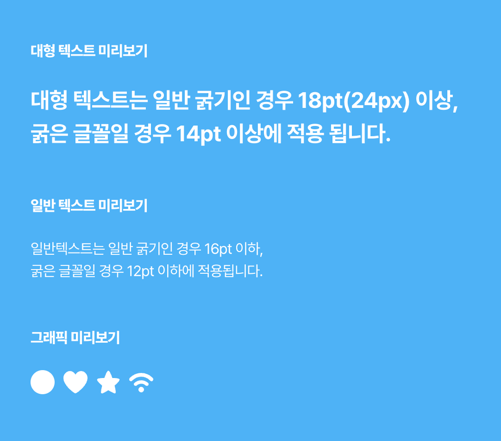
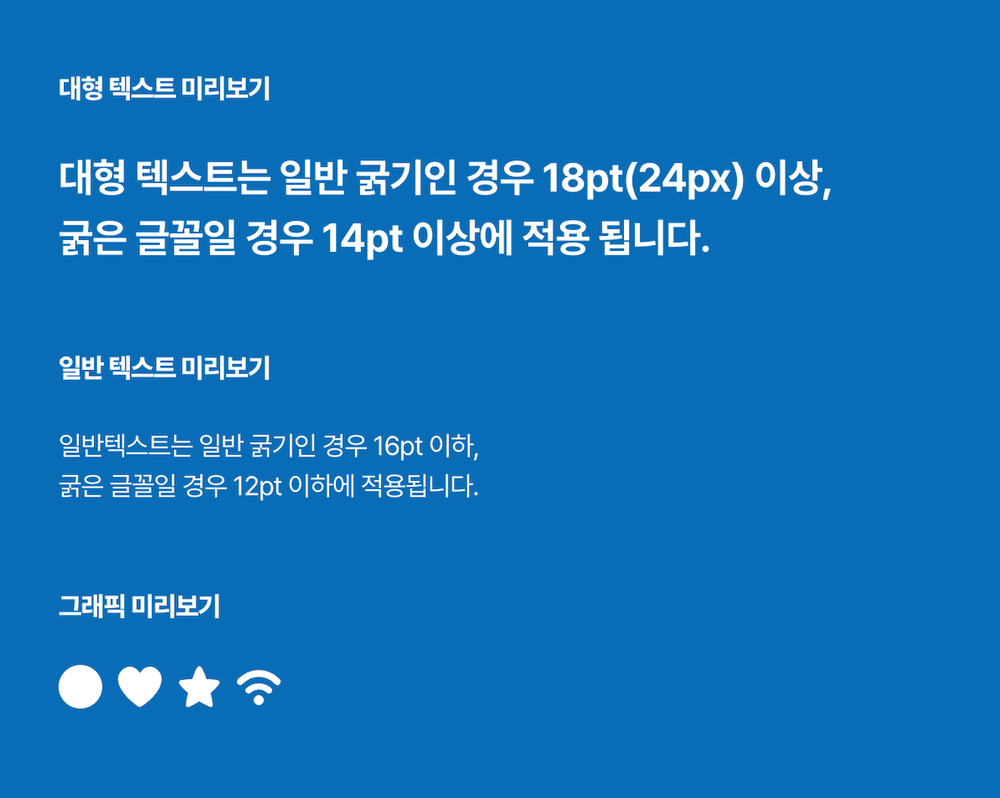
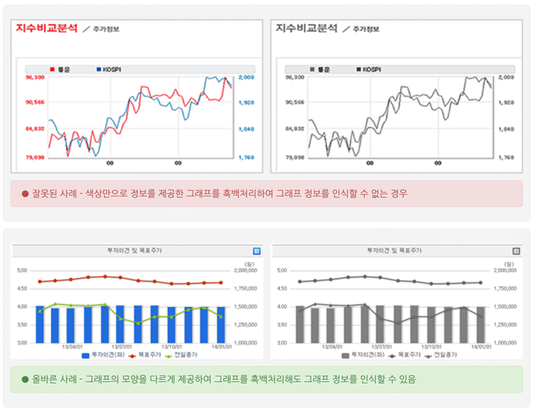

## What is the a11y ?
바로 본론으로 들어가서, `a11y`이란 무엇일까? 접근성이라는 의미를 가지는 `accessibility`의 줄임말이다. 첫번째 글자인 `a`와 마지막 글자인 `y` 사이에 11개 글자가 있기 때문에 편의상 `a11y`로 사용하고 있다. (이런 형태를 숫자약어 <a href='https://en.wikipedia.org/wiki/Numeronym' target="_blank" rel="noopener noreferrer">`Numeronym`</a> 라고 한다)
우리는 보통 웹접근성 (또는 정보통신접근성) 이라고 부른다. 그럼 웹접근성이란 구체적으로 어떤것일까. 아마 어떤 내용인지는 대략적으로 알고 있는 개발자들이 많을것이고 또 웹개발을 하면서 많은 접근성 이슈들을 마주하는 경우가 있을것이다. 
보통 우리가 웹접근성을 생각하는 경우 장애인들을 위한 배려/편의 사항이라는 생각이 지배적이지만, 꼭 그런 경우만 있는것은 아니다. 실제로 웹접근성 지침중 <u>키보드만으로도 웹서비스가 제공하는 모든 기능을 수행할수 있어야 한다</u>라는 지침이 있다. 이는 마우스 사용에 제한이 있는 장애인 뿐만 아니라 갑자기 마우스가 고장난 일반인도 해당하는 것이다. 이처럼 누구에게나 웹을 사용할때 불편함들 최소하하는 것이 웹 접근성이라고 할 수 있다.

<div class="quote">
무엇보다 웹접근성 보장은 「국가정보화기본법」과 「장애인차별금지 및 권리구제 등에 관한 법률(이하 "장애인차별금지법")」 등 법률에 명시된 의무사항이다
</div>

## Principals
한국의 웹접근성에 대한 기준은
- 인식의 용이성
- 운용의 용이성
- 이해의 용이성
- 견고성

<br/>

위 4가지로 구분하고 있다. 그중 웹개발에서 잘 다루어지는 몇가지 항목을 알아보자

### Alt attribute 
이미지는 웹사이트를 구축하는데에 빠지지 않는 요소중 하나이다. 이미지 태그를 사용할때에 `alt` 항목에 만약 이 이미지가 정상적으로 로드되지 못하였을때 노출할 텍스트를 넣어주어야 한다. 이는 이미지 로드 실패일때 뿐만 아니라, 스크린 리더를 사용하는 사람들이 웹사이트의 내용을 이해하는데 도움을 준다. (하지만 특별한 경우, 불필요한 설명이라고 판단이 된다면 대체텍스트를 제공하지 않아도 된다) 
대체텍스트 속성은 검색엔진 `score` 에도 도움을 주기 때문에 꼭 고려해야할 항목중 하나이다.

```html
    
```

### 텍스트의 명도대비 준수
웹사이트에서 텍스트를 사용하는 컨텐츠가 있을때, 저시력자와 고령자 등도 텍스트를 문제없이 인식도록 하기 위해 텍스트와 배경간의 명도대비는 `4.5:1` 이상이어야 한다.
몇가지 예외적인 사항이 있어 명도대비가 `3:1`도 허용되기도 하고, 포커싱 되었을대 명도대비가 커지는 이미지의 경우에는 명도대비 검사항목에 포함되지 않기도 한다. 아래 이미지는 <a href='https://sitero.co.kr/contrast' target="_blank" rel="noopener noreferrer">명도대비 체크 사이트</a>에서 생성해본 이미지 예시이다.

<div style="display:flex;">
<div style="width: 41%;margin-bottom: 15px; margin-left:auto; margin-right: auto;text-align: center">
    
    <span>명도대비 2.1:1</span>
</div>
<div style="width: 45%;margin-bottom: 15px; margin-left:auto; margin-right: auto;text-align: center">
    
    <span>명도대비 4.6:1</span>
</div>
</div>

### 최대한 색깔에 영향을 덜 받는 컨텐츠
웹사이트에 들어가는 다양할 색 조합은 색을 잘 구별하지 못하는 사용자, 흑백 디스플레이 등에서도 인식할 수 있도록 되어야 한다. 
예를 들어 색깔로만 어떠한 정보를 전달하는 이미지가 있을 경우, 흑백 디스플레이를 사용하는 사용자에게는 그 의미가 전혀 전달되지 않을 수 있다. 
색깔에 모든 정보를 담기보다 색상, 모양, 패턴 등 다양한 시각적 정보를 조합하여 색을 구별하기 어려운 사용자나, 흑백 디스플레이 사용자 등 모든 사용자들이 의미를 제대로 전달받고 사용할 수 있도록 제공해야 한다. 

<div style="width: 90%;margin-bottom: 15px; margin-left:auto; margin-right: auto;text-align: center">
    
</div>

### 명확한 지시사항 제공 

<br/>
<br/>
<div style="font-size:10px;color:#8b9196;word-break: break-all"><b>내용 및 이미지 출처</b><br/>
- https://en.wikipedia.org/wiki/Numeronym <br/>
- https://www.wa.or.kr/index.asp <br/>
- https://sitero.co.kr/contrast <br/>
- http://www.websoul.co.kr/accessibility/define.asp <br/>
- 논문: 국립전파연구원 한국형 웹 콘텐츠 접근성 지침 2.1 (Korean Web Content Accessibility Guidelines 2.1) / 국립전파연구원 고시 제2015-5호
</div>